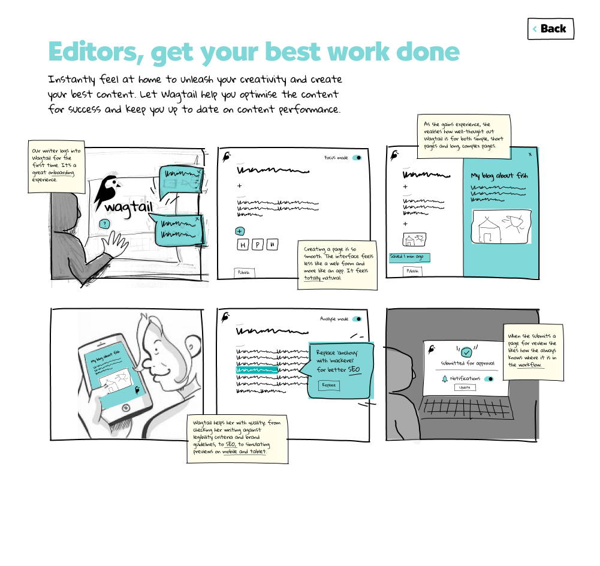
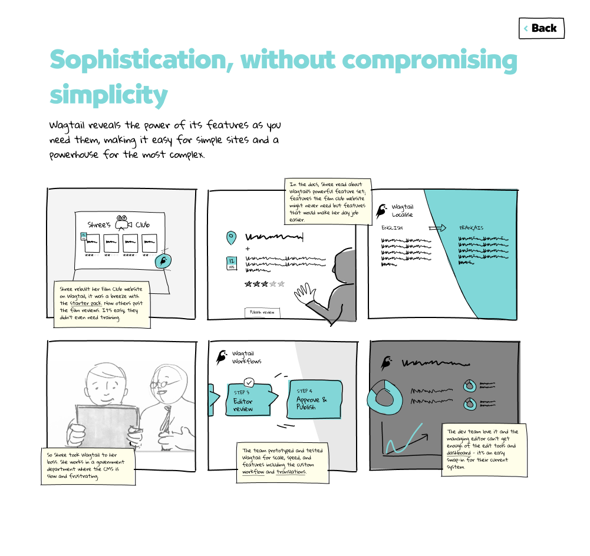
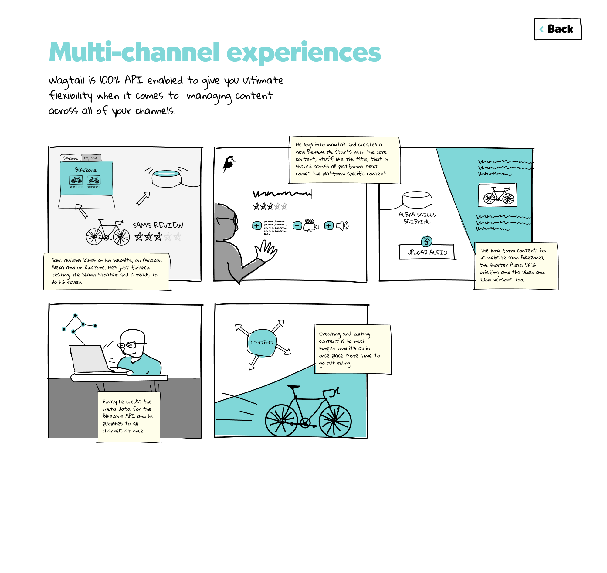
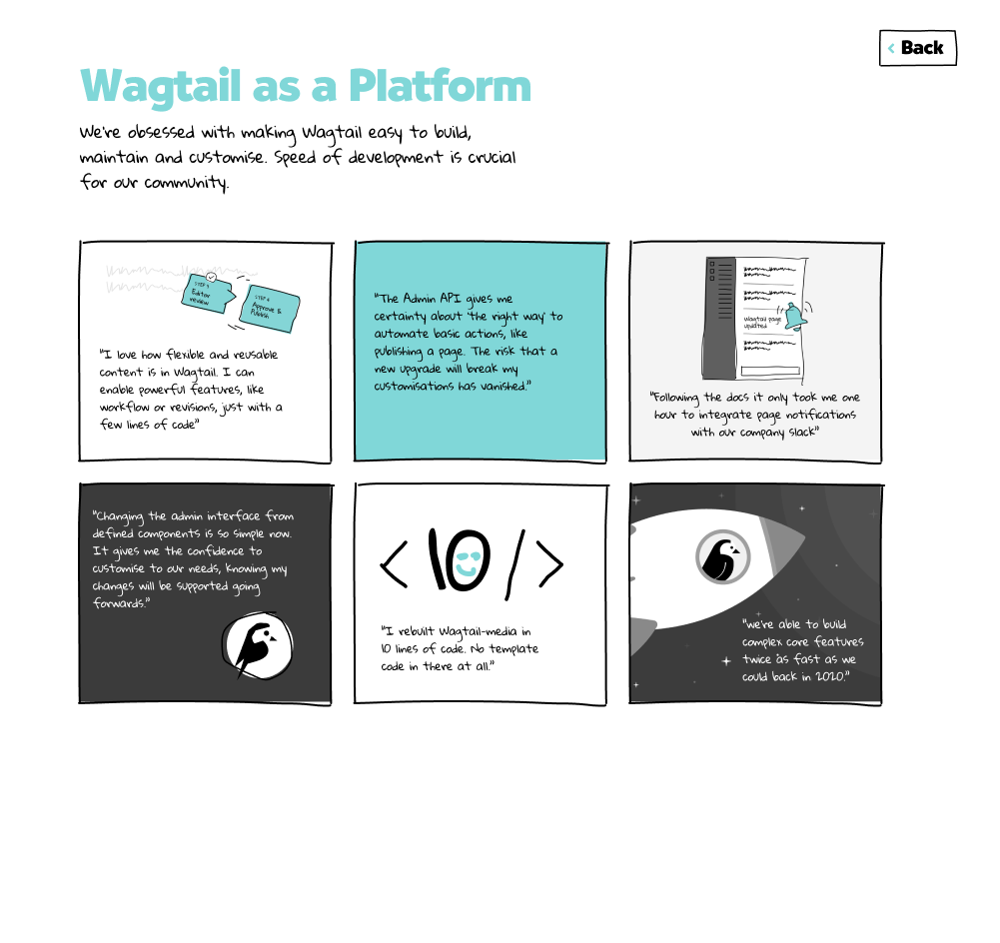
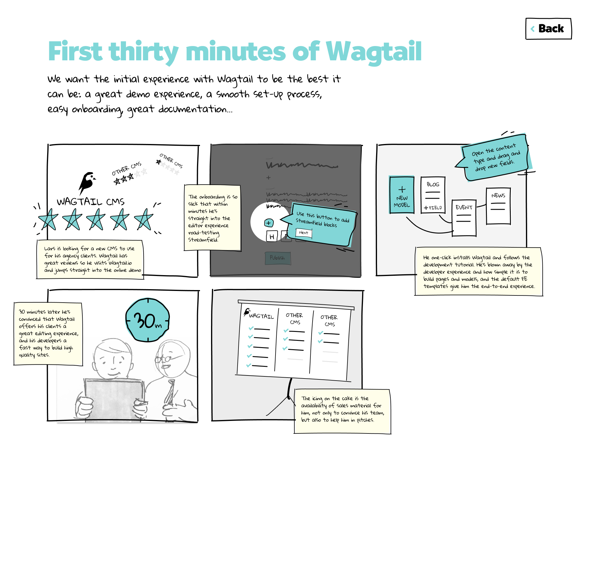

# RFC 1: Purpose and format

* RFC: 1
* Author: Phil Dexter, Tom Dyson, Karl Hobley, Olly Willians
* Created: 2021-08-05
* Last Modified: 2021-08-05

## Abstract

This RFC presents a vision for Wagtail for the next two years. It should help align the work on Wagtail through a better shared understanding of direction, help us to prepare a roadmap of work, and help us to prioritise the big pieces of work.

## Specification

The vision can be seen in the following 5 files.

For accessibility reasons, here are the five key pillars of the vision set out in text.

### Editors, get your best work done
Instantly feel at home to unleash your creativity and create your best content. Let Wagtail help you optimise the content for success and keep you up to date on content performance.

### Sophistication, without compromising simplicity
Wagtail reveals the power of its features as you need them, making it easy for simple sites and a powerhouse for the most complex.

### Multi-channel experiences
Wagtail is 100% API enabled to give you ultimate flexibility when it comes to  managing content across all of your channels.

### Wagtail as a Platform
We're obsessed with making Wagtail easy to build, maintain and customise. Speed of development is crucial for our community.

### First thirty minutes of Wagtail
We want the initial experience with Wagtail to be the best it can be: a great demo experience, a smooth set-up process, easy onboarding, great documentation...

## Open Questions

// We are actively looking for feedback, in agreement or disagreement, or adding to the vision.
