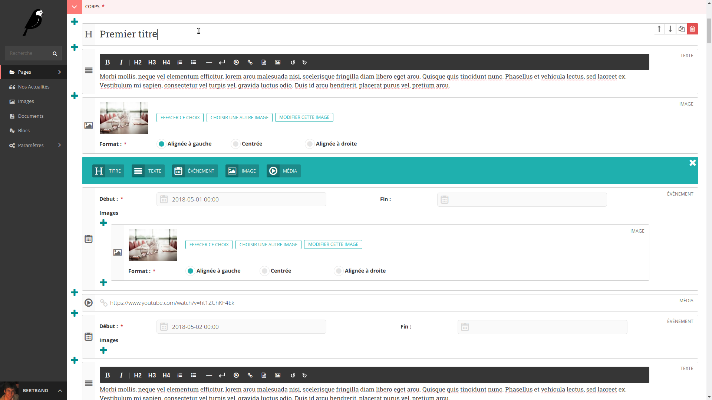
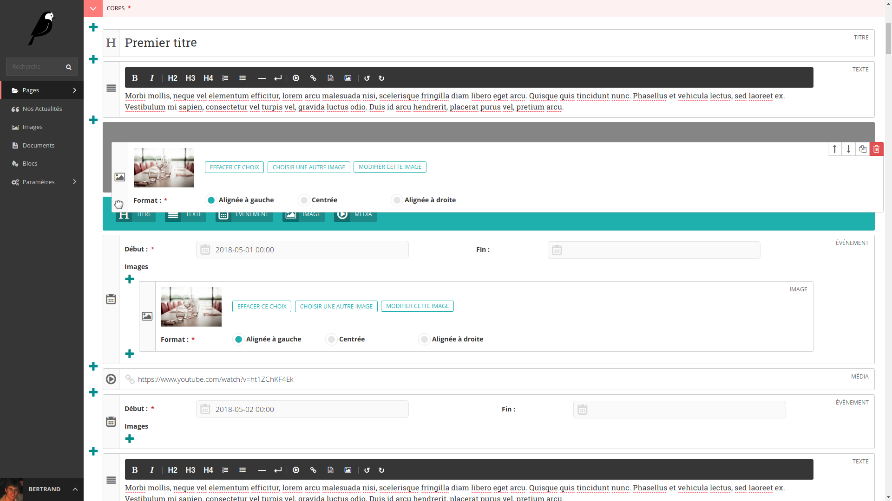
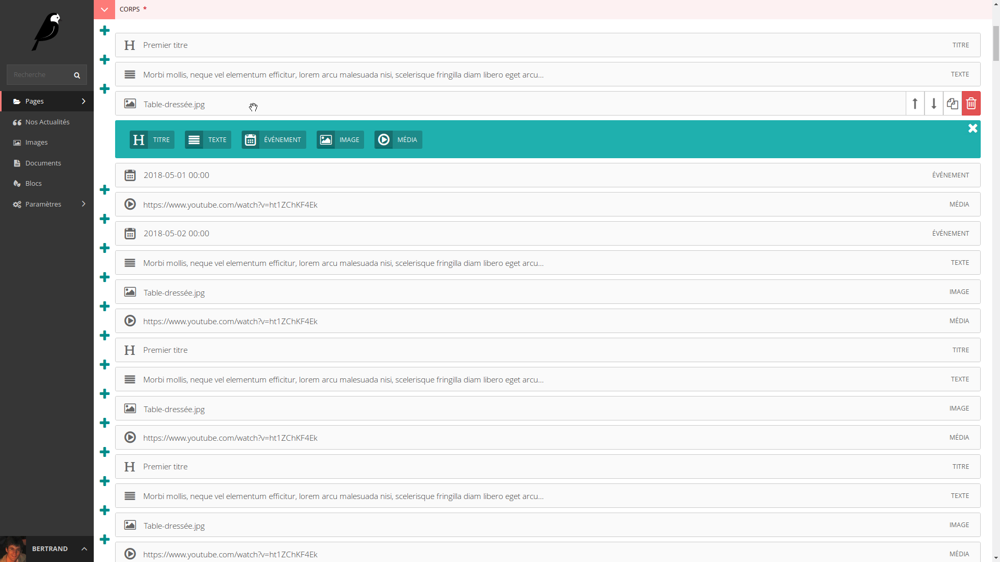
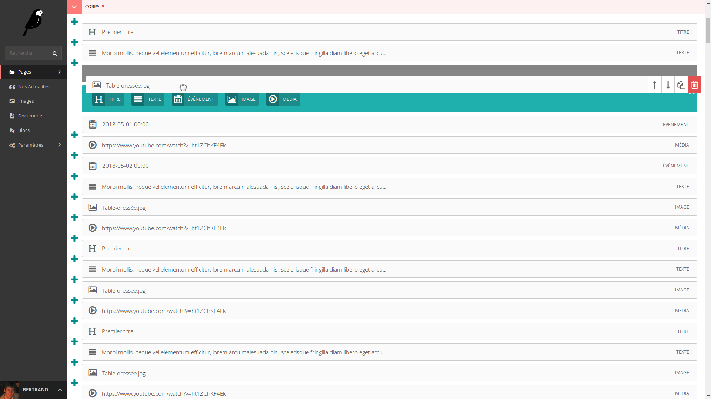
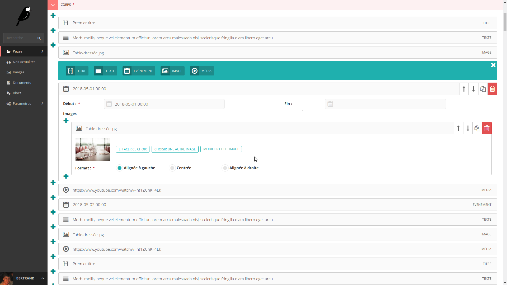
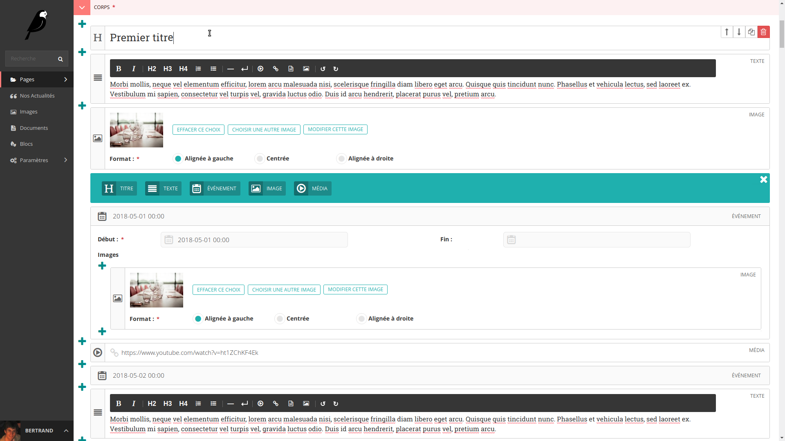
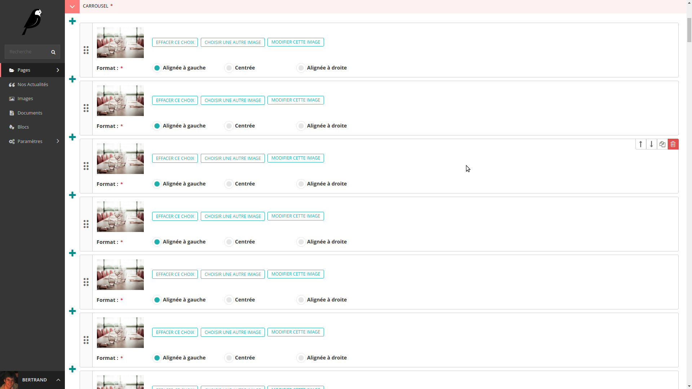
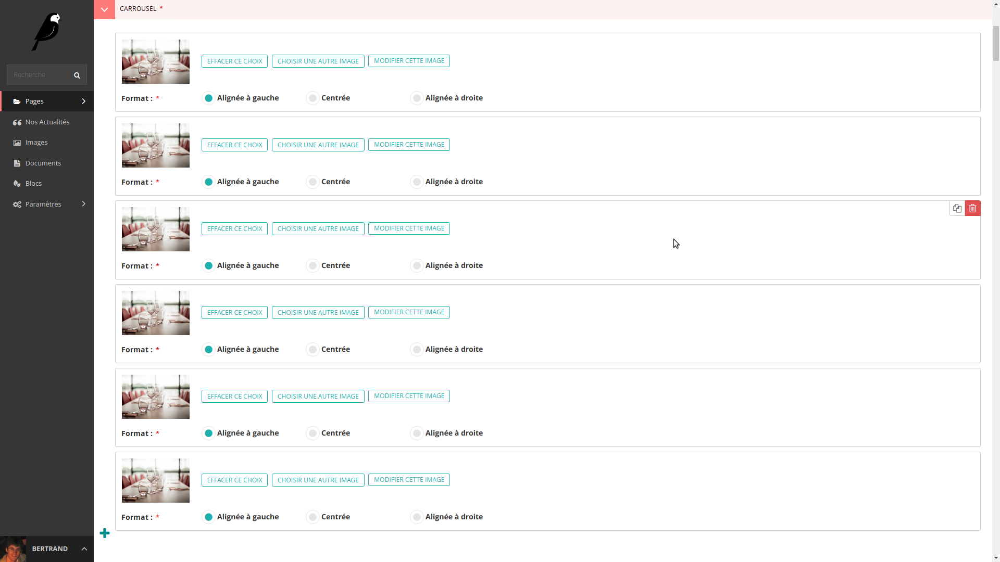
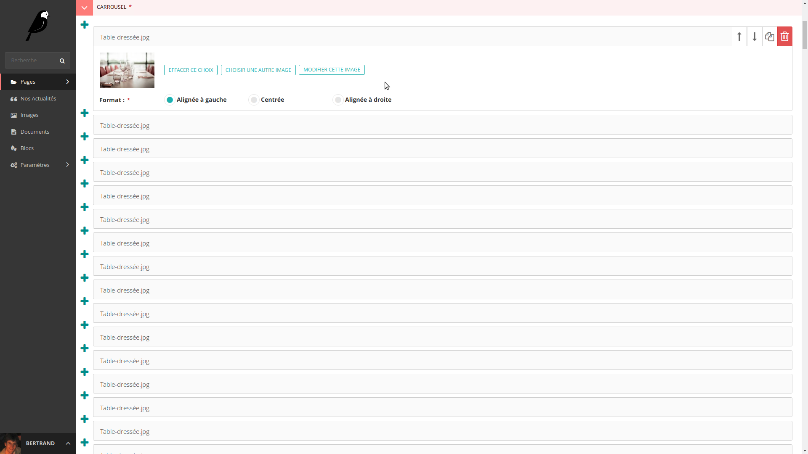
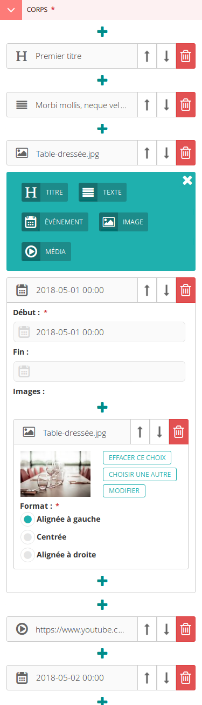

# RFC 26: New `StreamField` and `InlinePanel` user interfaces

* RFC: 26
* Author: Bertrand Bordage
* Created: 2018-05-11
* Last-Modified: 2018-05-11

## Abstract

This RFC proposes a brand new user interface for editing `StreamField`
and `InlinePanel` to improve ergonomics and consistency while adding
missing features: drag-and-drop, collapsible blocks, and duplication.

This work was funded via [a Kickstarter project launched by NoriPyt](https://www.kickstarter.com/projects/noripyt/wagtails-first-hatch).

## Current state of both technologies

`InlinePanel` arrived first in Wagtail, inspired by the Django admin inlines.
It’s a way to edit a list of structured data within the same form.

`StreamField` was originally designed by Torchbox to be an clean way to edit
rich text data instead of stuffing every content in a `RichTextField`.
But the community mostly saw in `StreamField` a solution to edit complex
structured data. Indeed, `StreamField` has potentially an unlimited flexibility
compared to `InlinePanel` that can only edit one level of blocks
of the same type.

`InlinePanel` & `StreamField` have very different user interfaces,
with different possibilities. For example, `InlinePanel` can only append inlines
at the end of the list, whereas `StreamField` allows it anywhere.

Note that dropping `InlinePanel` is out of the question.
The reason is that it stores strong links between data in the database,
which is safer than `StreamField`, especially in long-term projects.

## Structure of the proposal

For consistency, both `StreamField` and `InlinePanel` will look the same,
except that there will be no icon or block name in `InlinePanel`.

Both `StreamField` blocks and `InlinePanel` items
will have two types of layout:
- `SIMPLE`: all content is visible, best on simple sites (default)
- `COLLAPSIBLE`: most content is hidden, best for complex sites
                 with large inlines or nested blocks

`panels` will be usable in `StructBlock` like in `InlinePanel` and `Page`,
so we can define more complex layouts using e.g. `FieldRowPanel`.

To optimise spacing within a block/item, labels will have three different
positions (configurable in `FieldPanel``):
- `LEFT` (default)
- `ABOVE`
- `HIDDEN`

## Proposed interfaces

Given that most of the work will be front-end, most of the specification work
consists in design mockups.

There is a corresponding models.py for each proposal to show the backend
changes required by this work. 

### `SIMPLE` `StreamField`

```python
# models.py

from wagtail.admin.edit_handlers import (
    FieldPanel, FieldRowPanel, StreamFieldPanel,
)
from wagtail.core.blocks import (
    CharBlock, RichTextBlock, StructBlock, ChoiceBlock, DateBlock, ListBlock,
    EmbedBlock,
)
from wagtail.core.fields import StreamField
from wagtail.core.models import Page
from wagtail.images.blocks import ImageChooserBlock
from wagtail.images.edit_handlers import ImageChooserPanel


class TitleBlock(CharBlock):
    class Meta:
        icon = 'header'
        label = 'Titre'
        form_classname = 'full title'


class TextBlock(RichTextBlock):
    class Meta:
        icon = 'align-justify'
        label = 'Texte'
        form_classname = 'full'


class ImageBlock(StructBlock):
    image = ImageChooserBlock()
    format = ChoiceBlock(choices=[('left', 'Alignée à gauche'),
                                  ('center', 'Centrée'),
                                  ('right', 'Alignée à droite')])
    
    panels = [
        ImageChooserPanel('image', label_position=ImageChooserPanel.HIDDEN),
        FieldPanel('format'),
    ]
    
    class Meta:
        icon = 'image'
        label = 'Image'


class EventBlock(StructBlock):
    start = DateBlock(label='Début')
    end = DateBlock(required=False, label='Fin')
    images = ListBlock(ImageBlock())

    panels = [
        FieldRowPanel([
            FieldPanel('start'),
            FieldPanel('end'),
        ]),
        StreamFieldPanel('images', label_position=StreamFieldPanel.ABOVE),
    ]

    class Meta:
        icon = 'date'
        label = 'Événement'


# This class is for customising the block type name.
class MediaBlock(EmbedBlock):
    class Meta:
        icon = 'media'
        label = 'Média'


class Article(Page):
    body = StreamField([
        ('title', TitleBlock()),
        ('text', TextBlock()),
        ('image', ImageBlock()),
        ('event', EventBlock()),
        ('media', MediaBlock()),
    ])
    
    content_panels = Page.content_panels + [
        StreamFieldPanel('body'),
    ]
```

As you can see, we do not have to specify a layout,
by default it uses `SIMPLE`:



The action bar (move, duplicate & delete) is visible when the block has focus
or the mouse goes over it. Below it lies the block type. To avoid collisions,
all fields end before that action bar, so the inner width of the block
is reduced a bit. In case the width reduction poses is an issue for users,
switch to a `COLLAPSIBLE` block instead.

The vertical bar containing the block icon shows an open hand pointer when
the mouse goes over it, and it can be grabbed to drag the block
to a new position:



### `COLLAPSIBLE` `StreamField`

The models are the same, except that we use
`form_layout = CharBlock.COLLAPSIBLE` in each `Block` `Meta`.
There is no way to set the layout in `StreamFieldPanel`, and that’s on purpose:
switching to `COLLAPSIBLE` must be considered for each block type.
Here, all blocks are made `COLLAPSIBLE` for demonstration only.

As you will read later in that document, it is possible to mix `SIMPLE`
with `COLLAPSIBLE` blocks within the same `StreamField`.

```python
# models.py

from wagtail.admin.edit_handlers import (
    FieldPanel, FieldRowPanel, StreamFieldPanel,
)
from wagtail.core.blocks import (
    CharBlock, RichTextBlock, StructBlock, ChoiceBlock, DateBlock, ListBlock,
    EmbedBlock,
)
from wagtail.core.fields import StreamField
from wagtail.core.models import Page
from wagtail.images.blocks import ImageChooserBlock
from wagtail.images.edit_handlers import ImageChooserPanel


class TitleBlock(CharBlock):
    class Meta:
        icon = 'header'
        label = 'Titre'
        form_classname = 'full title'
        form_layout = CharBlock.COLLAPSIBLE


class TextBlock(RichTextBlock):
    class Meta:
        icon = 'align-justify'
        label = 'Texte'
        form_classname = 'full'
        form_layout = CharBlock.COLLAPSIBLE


class ImageBlock(StructBlock):
    image = ImageChooserBlock()
    format = ChoiceBlock(choices=[('left', 'Alignée à gauche'),
                                  ('center', 'Centrée'),
                                  ('right', 'Alignée à droite')])
    
    panels = [
        ImageChooserPanel('image', label_position=ImageChooserPanel.HIDDEN),
        FieldPanel('format'),
    ]
    
    class Meta:
        icon = 'image'
        label = 'Image'
        form_layout = CharBlock.COLLAPSIBLE


class EventBlock(StructBlock):
    start = DateBlock(label='Début')
    end = DateBlock(required=False, label='Fin')
    images = ListBlock(ImageBlock())

    panels = [
        FieldRowPanel([
            FieldPanel('start'),
            FieldPanel('end'),
        ]),
        StreamFieldPanel('images', label_position=StreamFieldPanel.ABOVE),
    ]

    class Meta:
        icon = 'date'
        label = 'Événement'
        form_layout = CharBlock.COLLAPSIBLE


# This class is for customising the block type name.
class MediaBlock(EmbedBlock):
    class Meta:
        icon = 'media'
        label = 'Média'
        form_layout = CharBlock.COLLAPSIBLE


class Article(Page):
    body = StreamField([
        ('title', TitleBlock()),
        ('text', TextBlock()),
        ('image', ImageBlock()),
        ('event', EventBlock()),
        ('media', MediaBlock()),
    ])
    
    content_panels = Page.content_panels + [
        StreamFieldPanel('body'),
    ]
```



A truncated abstract of the block is displayed in the horizontal bar. Its data
is dynamically updated from the first readable input. Optionally, we’ll allow
developers to define it in Python, which will be called via AJAX.

Like with `SIMPLE` layouts, `COLLAPSIBLE` blocks have actions that only show
when it has focus or when the mouse is over it.

It can also be grabbed by its horizontal bar: 



A single click on the horizontal bar without dragging opens the block: 



### Mix `SIMPLE` & `COLLAPSIBLE` in `StreamField`

Here, only `EventBlock` is made collapsible,
ending up with a mix of block layouts.

```python
# models.py

from wagtail.admin.edit_handlers import (
    FieldPanel, FieldRowPanel, StreamFieldPanel,
)
from wagtail.core.blocks import (
    CharBlock, RichTextBlock, StructBlock, ChoiceBlock, DateBlock, ListBlock,
    EmbedBlock,
)
from wagtail.core.fields import StreamField
from wagtail.core.models import Page
from wagtail.images.blocks import ImageChooserBlock
from wagtail.images.edit_handlers import ImageChooserPanel


class TitleBlock(CharBlock):
    class Meta:
        icon = 'header'
        label = 'Titre'
        form_classname = 'full title'


class TextBlock(RichTextBlock):
    class Meta:
        icon = 'align-justify'
        label = 'Texte'
        form_classname = 'full'


class ImageBlock(StructBlock):
    image = ImageChooserBlock()
    format = ChoiceBlock(choices=[('left', 'Alignée à gauche'),
                                  ('center', 'Centrée'),
                                  ('right', 'Alignée à droite')])
    
    panels = [
        ImageChooserPanel('image', label_position=ImageChooserPanel.HIDDEN),
        FieldPanel('format'),
    ]
    
    class Meta:
        icon = 'image'
        label = 'Image'


class EventBlock(StructBlock):
    start = DateBlock(label='Début')
    end = DateBlock(required=False, label='Fin')
    images = ListBlock(ImageBlock())

    panels = [
        FieldRowPanel([
            FieldPanel('start'),
            FieldPanel('end'),
        ]),
        StreamFieldPanel('images', label_position=StreamFieldPanel.ABOVE),
    ]

    class Meta:
        icon = 'date'
        label = 'Événement'


# This class is for customising the block type name.
class MediaBlock(EmbedBlock):
    class Meta:
        icon = 'media'
        label = 'Média'
        form_layout = CharBlock.COLLAPSIBLE


class Article(Page):
    body = StreamField([
        ('title', TitleBlock()),
        ('text', TextBlock()),
        ('image', ImageBlock()),
        ('event', EventBlock()),
        ('media', MediaBlock()),
    ])
    
    content_panels = Page.content_panels + [
        StreamFieldPanel('body'),
    ]
```



### `SIMPLE` `InlinePanel`

```python
# models.py

from django.conf import settings
from django.db.models import ForeignKey, PROTECT, CharField
from modelcluster.fields import ParentalKey
from wagtail.admin.edit_handlers import InlinePanel
from wagtail.core.models import Page, Orderable
from wagtail.images.edit_handlers import ImageChooserPanel


class CarouselImage(Orderable):
    page = ParentalKey('wagtailcore.Page', related_name='carousel_images')
    image = ForeignKey(settings.WAGTAILIMAGES_IMAGE_MODEL, related_name='+',
                       on_delete=PROTECT)
    format = CharField(max_length=10, choices=[('left', 'Alignée à gauche'),
                                               ('center', 'Centrée'),
                                               ('right', 'Alignée à droite')])

    panels = [
        ImageChooserPanel('image', label_position=ImageChooserPanel.HIDDEN),
        
    ]

    class Meta:
        verbose_name = 'image de carrousel'
        verbose_name_plural = 'images de carrousel'


class Article(Page):
    content_panels = Page.content_panels + [
        InlinePanel('carousel_images', heading='Carrousel'),
    ]
```

Like with `SIMPLE` `StreamField`, it is possible to grab each item using
the vertical bar, here with a grip icon.



In case the inline model doesn’t inherit from `Orderable`,
these interactions are removed:
- drag-and-drop
- move arrows
- all “+” buttons except the last one.



### `COLLAPSIBLE` `InlinePanel`

Same as `SIMPLE`, except we pass `layout=InlinePanel.COLLAPSIBLE` when creating
the inline panel.

```python
# models.py

from django.conf import settings
from django.db.models import ForeignKey, PROTECT, CharField
from modelcluster.fields import ParentalKey
from wagtail.admin.edit_handlers import InlinePanel
from wagtail.core.models import Page, Orderable
from wagtail.images.edit_handlers import ImageChooserPanel


class CarouselImage(Orderable):
    page = ParentalKey('wagtailcore.Page', related_name='carousel_images')
    image = ForeignKey(settings.WAGTAILIMAGES_IMAGE_MODEL, related_name='+',
                       on_delete=PROTECT)
    format = CharField(max_length=10, choices=[('left', 'Alignée à gauche'),
                                               ('center', 'Centrée'),
                                               ('right', 'Alignée à droite')])

    panels = [
        ImageChooserPanel('image', label_position=ImageChooserPanel.HIDDEN),
        
    ]

    class Meta:
        verbose_name = 'image de carrousel'
        verbose_name_plural = 'images de carrousel'


class Article(Page):
    content_panels = Page.content_panels + [
        InlinePanel('carousel_images', heading='Carrousel',
                    layout=InlinePanel.COLLAPSIBLE),
    ]
```



In case the inline model doesn’t inherit from `Orderable`,
these interactions are removed:
- drag-and-drop
- move arrows
- all “+” buttons except the last one.


## Responsiveness

It is very tricky to create a StreamField interface that would work
flawlessly on mobile phones. The main reason is that multiple levels of blocks
can be nested. The `SIMPLE` layout is out of the question on mobile, due to the
decreased width of the block content caused by the vertical bar
and the action bar.

The mobile version of `StreamField` and `InlinePanel` will always use
the `COLLAPSIBLE` layout, since it is the only one working great even
without nesting.

Switching between `SIMPLE` and `COLLAPSIBLE` will therefore have to be
`SASS`-only for optimal performance.

The layout is adjusted for better mobile ergonomics:
- action bars are always displayed
- the “+” button is centered
- the duplicate button is not displayed
- the block type is not displayed



## JavaScript

A reusable JavaScript library will be created for drag-and-drop.

For optimal performance, it will be written in pure JavaScript following
the 6th edition of the ECMAScript specification.

## Bonuses

If there is time left, these features will also be implemented:
- move blocks between different `StreamField`s using that block type
- add the possibility to update `COLLAPSIBLE` abstracts via AJAX
