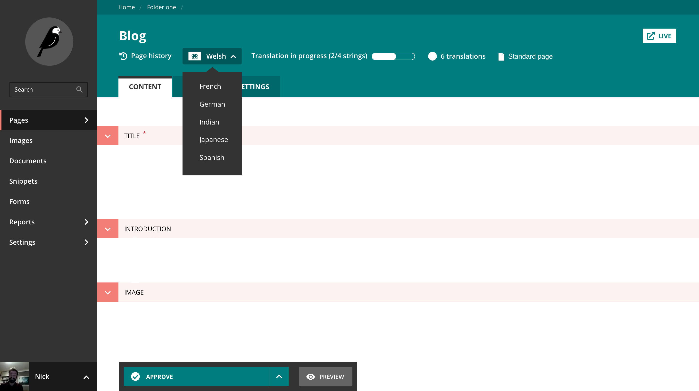

# RFC 54: Internationalisation of Wagtail content

* Authors: Karl Hobley
* Created: 2020-07-07
* Last Modified: 2020-07-07

## Summary

This RFC proposes an approach for implementing basic support for internationalised content in Wagtail.

In particular, it proposes the following:

* Add a [`Locale`](#the-locale-model) model to represent all of the locales used on a Wagtail instance
* Add `locale` and `translation_key` fields to `Page` to make them translatable
* Use the [multi-page](#multi-page-translation) [separated-tree](#separated-vs-combined-language-trees) approach for structuring content
* Add a [`TranslatableMixin`](#the-translatablemixin-abstract-model) with the `locale` and `translation_key` fields to allow Snippets, modeladmin models, and settings to be translated
* Implement some [unopinionated UI enhancements](#page-management-ui) for translated content (such as filters and language switchers). These enhancements would be disabled by default and enabled with [`WAGTAIL_I18N_ENABLED`](#settings) setting
* Implement a [solution for language-aware URL routing](#sites-and-page-routing) that works with Django's [`i18n_patterns`](https://docs.djangoproject.com/en/3.0/topics/i18n/translation/#django.conf.urls.i18n.i18n_patterns) and [`LocaleMiddleware`](https://docs.djangoproject.com/en/3.0/ref/middleware/#django.middleware.locale.LocaleMiddleware)
* Implement multi language support in the [API](#the-api), [Search](#search) and [Sitemaps](#sitemaps) modules

This RFC does not propose any solution for translation management or workflow. This would remain the responsibility of third-party modules such as [`wagtailtrans`](https://github.com/wagtail/wagtailtrans) and [`wagtail-localize`](https://github.com/wagtail/wagtail-localize).

### Differences from RFC 9

This RFC effectively replaces [RFC 9](https://github.com/wagtail/rfcs/pull/9). The main differences are:

* Adds the fields directly to `Page` instead of a creating separate page model
* Provides support for translating non-page models
* Excludes translation management / workflow. This RFC only includes the models for representing locales and translations and some unopinionated UI improvements. I think translation management is best done by third-party modules as there’s a few different workflows someone might want to implement for this.

## Motivation

### Why implement internationalisation in Wagtail core?

There are a few things that are really hard/impossible to implement in a third party package:

#### Deeper integration with other Wagtail features and UI without needing a lot of hooks

In the “Integration with the rest of Wagtail" section below, I describe some ways we can improve other parts of Wagtail to be aware of locales.

These are very difficult to implement from a third-party module though. The only way to do it would be to implement hooks for every feature, but these can be come a maintainability burden for Wagtail as refactoring parts of code which use hooks needs to take into account all the use cases of those hooks, including non-internationalisation ones.

One example of this is when we refactored the explorer menu into a React component. We needed to account for the `construct_explorer_page_queryset_hook` by implementing a new `for_explorer` filter in the admin API.

#### Language-aware URL routing

Wagtail’s built-in [`serve` view](https://github.com/wagtail/wagtail/blob/master/wagtail/core/views.py#L10) does not account for the language set by Django’s [`LocaleMiddleware`](https://docs.djangoproject.com/en/3.0/ref/middleware/#django.middleware.locale.LocaleMiddleware)/[`i18n_patterns`](https://docs.djangoproject.com/en/3.0/topics/i18n/translation/#django.conf.urls.i18n.i18n_patterns). Both `wagtail-localize` and `wagtailtrans` work around this issue in different ways:

* `wagtail-localize` overrides the `route()` method on homepages to redirect requests into the correct language tree. But the problem with this is Wagtail is unable to reverse the URLs to non-english pages so it also monkey-patches [`Site.get_root_paths`](https://github.com/wagtail/wagtail/blob/8c306910dd86e09cea11196715da47c6a54c722b/wagtail/core/models.py#L169-L185) and [`Page.get_url`](https://github.com/wagtail/wagtail/blob/8c306910dd86e09cea11196715da47c6a54c722b/wagtail/core/models.py#L874-L906). to override this logic.
* `wagtailtrans` sets the slug of the homepages to match the language codes, but this relies on editors to set them correctly and doesn't make use of `i18n_patterns` which the site should be using anyway for Django views (eg, search).

If this logic was standardised, we could implement this in a way that works well with Django tools without having to monkey-patch Wagtail's internal logic from third-party modules.

#### Simpler queries for filtering by language

Having the `locale` field on the base `Page` model makes it much simpler to filter pages by language. This is important for supporting locale filters in the page explorer and the API as both of these places work with the base `Page` model and having to `JOIN` data from child models would impact performance.

#### A standard approach that can be built on by many third-party libraries

Currently, each translation app has to reinvent these models. If we decide on a standard approach, it would provide a foundation for building better translation workflows. It would also make it easier for users to migrate between different workflow modules as more get created in the future.

### Drawbacks

#### What if it turns out later to not be the best approach?

In this document I will go into all the other approaches we've come across in the past and compare them so you can decide if this is the best approach. It’s been 6 years since Wagtail was released so we’ve most likely found most of the possible approaches for translation already. We’re in the best place we’ve ever been to pick a standard approach.

If we do find a better approach later, we might be able to support it for a period of time alongside this approach to allow users to migrate (if a migration is necessary), then remove this approach in a subsequent major release.

## High level design

### Guiding principles

#### Use Django's existing utilities

Wagtail’s internationalisation implementation should work well with existing Django internationalisation utilities such as [`i18n_patterns`](https://docs.djangoproject.com/en/3.0/topics/i18n/translation/#django.conf.urls.i18n.i18n_patterns) and the [`LocaleMiddleware`](https://docs.djangoproject.com/en/3.0/ref/middleware/#django.middleware.locale.LocaleMiddleware) and not reinvent anything unless there is no other way.

#### Don’t get in the way when translations are not required

Most Wagtail sites do not require internationalisation so any UI we add to support it should be disabled by default.

We will introduce a setting called [`WAGTAIL_I18N_ENABLED`](#settings) that is `False` by default. The UI changes will not take effect unless this is set to `True`.

#### Don’t break existing internationalisation implementations

There are already many sites out there that run on existing tools like [`wagtailtrans`](https://github.com/wagtail/wagtailtrans) and [`wagtail-modeltranslation`](https://github.com/infoportugal/wagtail-modeltranslation) as well as a bunch of bespoke implementations.

We should do our best to avoid breaking backwards compatibility for these. The goal is that anyone with an existing internationalisation implementation will continue to work after these changes have been made, but they won’t get all of the improvements specified later in this RFC.

#### Leave unnecessary parts out to allow innovation

This RFC purposefully leaves out any UI to actually create and manage translations. There is probably quite a few different ways this can be done that we haven’t explored yet. `wagtail-localize` has made a lot of progress recently on its workflow, but it would be a while until it’s fully mature. But even when that matures, there are probably other ways to manage translations and there’s no need to standardise on one approach for that now as hooking the views required for these apps is simple.

### Multi-page translation

As mentioned in the summary, this RFC proposes to implement **multi-page** translation. This section compares this approach with the other possible way, **multi-field** translation.

In **multi-page** translation, each language of a page is represented with a different page.

In **multi-field** translation, each language is represented on the same page but the translatable fields are duplicated for each language.

Advantages of multi-page translation over multi-field are:

* **Translations can be published at different times and be in different states** - A page can either be live or draft. If the translations are all on the same page, they all need to be published at the same time.
* **Content can be authored in any language** - In multi-field, you normally need to choose one language to be your default language
* **Duplicating pages scales better for many languages** - After you get over about 3 different languages, duplication of fields starts to hit performance problems in migrations and the page editor
* **It doesn't require any magic to insert fields into models** - duplicating the fields can get unwieldy if done manually. So usually some sort of meta-class has to be used to add them. This can make page models harder to work with.
* **Page slugs can also be translated** - Wagtail only has one slug field and this can’t be duplicated without customising the way Wagtail’s routing works.

The main disadvantage to this approach is non-translated fields that you might want to remain the same for all languages will be duplicated for each language. It is possible to keep these fields in sync across all the pages, but this synchronisation is best done at the point translations are applied to a page to prevent inconsistencies from occuring (such as an image and its caption not matching). For this reason, this bit of logic should be implemented by the third-party translation management module.

### Separated vs combined language trees

When using a multi-page approach, there are two possible ways to structure the pages:

* **Combined tree** - single tree where translations are added as siblings of the source page
* **Separated tree** - each language has its own completely separate tree

Advantages of **combined tree** are:

* **Incremental translation is easier** - You can translate any page in the source tree. As each translation is always a sibling, you don’t need to translate all of its parents. It’s also easier to write queries that fall back to other languages

Advantages of **separated tree** are:

* **Page queries are simplified** - you don’t need to filter out other languages from `get_children` or `get_siblings`. Also, you can perform any query from any page and get correct results (when using the **combined tree** approach, running `get_children` from a translation will never return results)
* **Permissions and Workflows can be configured per-language** - Wagtail permissions and workflows are both hooked into the tree and inherited. Using a separated tree approach allows translators to be grouped by their locale and only given permission to pages in that locale
* **Different locales can be structured differently** - The main advantage to this is it allows page structure to be updated asynchronously, which would be good for performance on sites with many locales.

The models in this RFC could, in theory, work with both of these approaches. But in order to actually allow this there are a few places that would need to take both approaches into account:

* `copy_for_translation` would need to be able to copy pages into either structure
* We would need support two completely different methods to route translatated pages and each of these would require a different method of generating page URLs too
* There are a few smaller areas of logic to consider such as moving pages and updating the logic for the `Page.max_num` attribute.

To keep it simple, I propose we only support the **separate tree** approach for now. It would be possible to add support for combined tree later if there is demand for that.

#### What about multiple-sites?

Wagtail instances that have multiple sites already have multiple trees. The locale-specific trees will also be created at the root level, so if you have two sites in two languages you will end up with four pages at the root.

So the page explorer doesn’t get too cluttered, we will add a filter so it only displays one language at a time at the root level. See the screenshot later in this document for an example of how this might look. This feature would be enabled by the `WAGTAIL_I18N_ENABLED` setting.

## Important technical decisions

### Locales and Languages

This RFC proposes to add a `Locale` model with a `language_code` field. The options for the `language_code` field are defined by a setting called `WAGTAIL_CONTENT_LANGUAGES`. This looks inconsistent, but locales have a different meaning to languages:

> Locale A collection of international preferences, generally related to a language and geographic region that a (certain category) of users require. These are usually identified by a shorthand identifier or token, such as a language tag, that is passed from the environment to various processes to get culturally affected behaviour.

[https://www.w3.org/TR/ltli/](https://www.w3.org/TR/ltli/)

Developers and users should be thinking in locales as the language used in each locale is only one part of a locale. Examples of other parts include (taken from the above document):

* Presentation (human-oriented formatting) of dates, times, numbers, lists, and other values
* Collation, sorting, and organization of content (such as in a phone book or a dictionary)
* Alternate time-keeping and calendars, which may include holidays, work rules, weekday/weekend distinctions, the number and organization of months, the numbering of years, and so forth
* Tax or regulatory regime
* Currency

However, browsers only send us a ”language code” in the format `en-GB` so I think it makes sense for the locales to be defined by their language code.

This term is also used in this way by Django, the [`LocaleMiddleware`](https://docs.djangoproject.com/en/3.0/ref/middleware/#django.middleware.locale.LocaleMiddleware) implements the logic for deciding which language to use from the user’s web browser’s language code or a cookie.

#### Why store Locales in the database when they are already defined in settings?

It's possible that the list of locales can change over time and having a `Locale` database record allows the langauge code to be changed easily. I think it's also beneficial to have a setting that restricts the possible language codes a locale can have, so that editors don't use locales are not supported on the site (for example, langauges that don't have template translations or are incompatible with any bespoke localisation code).

#### How are locale records created?

The first `Locale` record is created by a migration using the language code defined in `LANGUAGE_CODE`. All existing pages will get this locale. For non-internationalised sites, this will be the only `Locale`.

Any subsequent locales are created in a management interface by an adminstrator or developer.

### Approaches for joining translations together

We need to decide a way to identify which pages are translations of one another. This RFC proposes to add a `translation_key` field to all translatable models. This idea originally came from [`RFC-9`](https://github.com/neon-jungle/wagtail-rfcs/blob/0008-translations/draft/0009-translations.rst).

The `translation_key` is a `UUID` field that tells us which instances are translations of one another as translations share the same value for this field. When we create a new object, we generate a new UUID. But when we translate an instance, we copy its UUID to the new instance.

The advantages of this are:

* Database constraints are easy to define. You just need a `unique_together` on `translation_key` and `locale`
* It's easy to create new instances and query an instance for its translations
* It doesn't require an external model to track translations and also doesn’t require a default language to be defined for the whole site.
* The UUID can be repurposed as an identifier for the instance in a translation system. It it also used by [`wagtail-localize`](https://github.com/wagtail/wagtail-localize) for as a stable identifier for child objects (which is needed to identify where a translatable string came from. Child objects can have `None` as their primary key before they’re published).

#### UUIDs are random numbers, if I had a site with millions of pages, what are the chances that two of them would be assigned the same UUID by mistake?

According to Wikipedia:

> Thus, the probability to find a duplicate within 103 trillion version-4 UUIDs is one in a billion.

[https://en.wikipedia.org/wiki/Universally_unique_identifier#Collisions](https://en.wikipedia.org/wiki/Universally_unique_identifier#Collisions)

So as long as you don’t have more than 103 trillion pages, the chance of two pages being given the same UUID will always be less than 1 in a billion.

If however, you are running Wagtail in a predictable environment (the random number generator was replaced with something not random), there’s a chance it might generate the same one twice. But such an environment would be extremely terrible for security so we can assume nobody uses something like that in the wild.

#### Alternatives

All the alternatives have a space saving advantage in that `ForeignKey`s are usually 32 bit integers but UUID’s are 128 bits so 4 times bigger. But none of them have any advantage beyond that. Each one has disadvantages that I think outweigh this one advantage:

* A `ForeignKey` to the source page (For example `canonical_page` in [`wagtailtrans`](https://github.com/wagtail/wagtailtrans))
  * You can’t have a `unique_together` constraint on this `ForeignKey` and `locale` because the source pages will have this field set to `None` (they can’t have a `ForeignKey` to themself!)
  * Querying logic needs to also take this fact into account and query for both the source pages and translations using separate filters (For example, `Q(id=source_id) | Q(source_id=source_id)`). This isn’t a huge deal, but you have to do this in a lot of places!
  * Deletion of the source requires choosing a new source language and updating all the translations
* A `ForeignKey` to a different model (where there is one instance of that model for each group of translated instances)
  * This one is very similar to the proposed UUID approach, but instead of generating a UUID, it’s generating an ID from the `AutoField` of another model. This ID could be treated exactly the same as the UUID for querying and database constraints.
  * The tricky part of this approach is that we either have to find a way to create an instance of this model whenever something translatable is created (which could also be a non-page model). Or allow `None` in this field and generate the instance when the first translation is made, but this would require making the database constraints less restricted. In my opinion, a stronger database constraint beats a slightly smaller field size.
* An additional `AutoField` that generates integer translation keys instead of `UUID`s
  * Unfortunately, Django doesn’t allow more than one `AutoField` on a model

## Existing internationalisation implementations

There’s already solutions for building internationalised sites out there. This section will go over each one and how they would be impacted by these changes.

### Custom builds

Many Wagtail internationalisation implementations are completely bespoke (in fact, the second ever Wagtail site after RCA even had internationalisation!). The internationalisation docs were written in 2015 and covered two approaches for creating a bespoke implementation. They were later removed in favour of encouraging users to use one of the third-party modules that were developed since then.

It’s hard to say how these will be impacted as not everybody would’ve followed the documentation. I think as long as they don’t already have a `locale` or `translation_key` field (the documentation used different fields) and they leave `WAGTAIL_I18N_ENABLED` off, they should be unaffected.

### [`wagtail-modeltranslation`](https://github.com/infoportugal/wagtail-modeltranslation)

This module uses the multi-field approach. While this isn’t the approach I propose supporting in Wagtail core, I think this is a valid approach in specific circumstances (small site, few languages, polyglot editors).

As this uses a fundamentally different approach, I don’t think makes sense to migrate to these new models. We should make sure that none of our changes prevent users of `wagtail-modeltranslation` from updating Wagtail.

### [`wagtailtrans`](https://github.com/wagtail/wagtailtrans)

This module is the first internationalisation package to be supported by the Wagtail core team. It’s an implementation of the multi-page approach and based on RFC 9.

It should be possible to write a data migration to migrate existing implementations to use the new builtin fields and take advantage of the new UI improvements in Wagtail. The rest of `wagtailtrans` would still exist to provide a simple translation workflow.

### [`wagtail-localize`](https://github.com/wagtail/wagtail-localize)

Wagtail Localize (originally wagtail-i18n) was developed from work I did for Google in November 2018, and updated since then for Department of International Trade and Mozilla. It started out as a rewrite of `wagtailtrans` to use mixins instead of an intermediate page model which allows it to translate snippets. It couldn’t later be re-merged due to the complexity of migrating existing `wagtailtrans` implementations to use mixins.

The models in this RFC are very similar to what `wagtail-localize` currently has. It should be easy to refactor it as a translation workflow module using the new models.  Except for Mozilla, there are currently no production users of Wagtail localize so migration won’t be a problem.

## Detailed specification of core changes

### Settings

#### `WAGTAIL_I18N_ENABLED`

(boolean, default `False`)

When set to `True`, this enables all of the UI enhancements specified later on in this RFC.

#### `WAGTAIL_CONTENT_LANGUAGES`

(list, default `[]`)

A list of languages that Wagtail content can exist in. This list is in the exact same format as Django’s [`LANGUAGES`](https://docs.djangoproject.com/en/3.0/ref/settings/#languages) setting. It’s separate from that because you might not want all your Django [`LANGUAGES`](https://docs.djangoproject.com/en/3.0/ref/settings/#languages) to have a copy of the Wagtail content.

For example, you may have the following in your Django [`LANGUAGES`](https://docs.djangoproject.com/en/3.0/ref/settings/#languages):

```python
LANGUAGES = [
    ('en', _("English (United Kingdom)")),
    ('en-US', _("English (United States)")),
    ('es', _("Spanish (Spain)")),
    ('es-MX', _("Spanish (Mexico)")),
]
```

But only support the generic languages in your `WAGTAIL_CONTENT_LANGUAGES`:

```python
WAGTAIL_CONTENT_LANGUAGES = [
    ('en', _("English")),
    ('es', _("Spanish")),
]
```

This would mean that your site will respond on the URLs `https://www.mysite.com/es-ES/` but you can only author content in one variant of English and Spanish.

Note: `WAGTAIL_CONTENT_LANGUAGES` must be a subset of `LANGUAGES`, hence why I used `es` instead of `es-ES` for the "Spanish (Spain)" locale. This allows us generate URLs to pages from the admin. If we allowed content to be created using a code that isn't `LANGUAGES` we wouldn't know what language code to use for these URLs.

The structure has been made the same on purpose, so you can set them both to the same value if you want to:

```python
LANGUAGES = WAGTAIL_CONTENT_LANGUAGES = [
    ('en-GB', _("English (United Kingdom)")),
    ('en-US', _("English (United States)")),
    ('es-ES', _("Spanish (Spain)")),
    ('es-MX', _("Spanish (Mexico)")),
]
```

### The `Locale` model

The `Locale` model defines the set of locales that can be used on a site. Initially, Wagtail will create one `Locale` that corresponds to the `LANGUAGE_CODE` on the site. All sites will have at least one locale, including those that don't use the internationalisation features.

When `WAGTAIL_I18N_ENABLED` is `False` all new pages will inherit their parents locale. This is to satisfy the database constraints but also makes it easy for someone to switch on internationalisation later.

#### Changing `LANGUAGE_CODE`

It's possible that a site may change it's language code during development. If this happens, we will not update the `Locale` object or create a new one. If `WAGTAIL_I18N_ENABLED` is `False`, pages will continue to inherit their parent's locale even if that doesn't match the current `LANGUAGE_CODE`.

For sites that don't have `WAGTAIL_I18N_ENABLED`, it's important that we make sure all pages share the same locale as this will make it much easier for them to enable internationalisation later.

All locales (except for the initial one created in a migration) will be set up by an administrator. If the `LANGUAGE_CODE` on a site is changed, it's up to an administrator or developer to update the `Locale` record to match it.

#### Changing `WAGTAIL_CONTENT_LANGUAGES`

It's possible for languages to be added or removed from `WAGTAIL_CONTENT_LANGUAGES` over time. If this happens, it's up to the developer to update the `Locale` model accordingly so that it reflects the latest `WAGTAIL_CONTENT_LANGUAGES`.

We shouldn't add new locales automatically as there may be cases where changing the `language_code` of an existing `Locale` would make more sense.

If a language code is removed from `WAGTAIL_CONTENT_LANGUAGES`, the corresponding `Locale` will be filtered out from `Locale.objects`. This will stop the locale from appearing anywhere in the Wagtail UI and also stop traffic from being routed to it. This `Locale` will show up with a warning in the Locales UI.

#### Fields

* `language_code` (string, unique) - This is a language code taken from the list in `WAGTAIL_CONTENT_LANGUAGES`. Locales are defined by their language. The language code must be a [BCP 47 language tag](https://tools.ietf.org/html/bcp47) (the same format used in Django).

#### Methods

* `@classmethod get_default()` - This returns the default `locale` based on the value of the `LANGUAGE_CODE` setting
* `@classmethod get_active()` - This returns the currently activated locale
* `get_display_name()` - This returns the display name that is defined in `WAGTAIL_CONTENT_LANGUAGES`

### The `TranslatableMixin` abstract model

The `TranslatableMixin` abstract model can be applied to any other Django model. This is already applied to the `Page` model out of the box so the below fields/methods will exist on `Page` too.

#### Fields

* `locale` Foreign Key to `Locale`. For pages, this defaults to the locale of the parent page.
* `translation_key` A UUID that is randomly generated whenever a new model instance is created. This is shared with all translations of that instance so can be used for querying translations.

Both of these fields will have a unique key to prevent something from being translated into the same language twice.

Note that these fields will exist regardless of whether `WAGTAIL_I18N_ENABLED` has been set. They shouldn’t get in the way of anything. Neither [`wagtailtrans`](https://github.com/wagtail/wagtailtrans) nor [`wagtail-modeltranslation`](https://github.com/infoportugal/wagtail-modeltranslation) use these field names.

#### Methods

* `get_translations(inclusive=False)` - Returns a `QuerySet` of translations for this object. By default it excludes the object itself. To include the current object, set `inclusive` to `True`
* `get_translation(locale)` - Returns a translated object if one exists in the specified locale, otherwise raises `model.DoesNotExist`
* `get_translation_or_none(locale)` - Returns a translated object if one exists in the specified locale, otherwise returns `None`
* `has_translation(locale)` - Returns a boolean if a translation for this object exists in the specified locale.
* `copy_for_translation(locale)` - Generates a copy of the object with the same content and `translation_key` but a different `locale`
* `@classmethod get_translation_model()` - Returns the model which `TranslatableMixin` is defined. This is useful to help some logic handle models that use multi-table inheritance.
* `@property local` - This gets the translated object for the active language. If no translation exists, this returns `self`. This can be called from templates similarly to `.specific`

#### Clusterable models

`copy_for_translation` would need to behave differently for models that inherit from Django modelcluster's `ClusterableModel` as these models will have "child objects" that would need to be copied as well. If these child objects are translatable, we will need to update their locale too.

#### Checking the `unique_together` constraint is not accidentally removed

When you add `unique_together` constraints in abstract models, it’s possible that it could be removed by a model that uses it if that model also overrides any `Meta` options.

We will add a system check to make sure the `unique_together` constraint is not mistakenly removed from the `locale` / `translation_key` fields.

### Other changes to `Page` model

Apart from inheriting [`TranslatableMixin`](#the-translatablemixin-abstract-model) and taking on its fields and methods, some other changes are made directly to the `Page` model.

Apart from `locale` and `translation_key` that come from `TranslatableMixin` no other fields will be added to `Page`.

#### Changed Methods

* `copy` - We need to generate a new `translation_key` whenever a page is copied
* `can_move_to` - We need to restrict page moves to within the same locale
* `with_content_json` - We need to add `translation_key` and `locale` to the fields that are overridden with the live version. This is because these fields won’t exist in old revisions.

#### Overridden methods

* `copy_for_translation(locale, copy_parents=False)`  - Overridden to be based on `Page.copy()` but also implement a `copy_parents` flag. When set to `True` this will copy any parents that are not translated yet in order for the structure to match the source tree. If the parent doesn’t exist and `copy_parents` is `False`, this method would raise a `ParentNotTranslated` exception. This method always creates copies in draft.
* `@property local` - Overridden to check if the translation is live. We will provide a separate property that will return drafts `@property local_draft`

#### Other logic

* When pages are created, they always take their parent’s `locale`, unless their parent's locale is `None`. If the parent's `locale` is `None`, the child can have any locale it likes, including `None`.
* When rich text fields are rendered, any internal links will be automatically localised. For example, if a French page has an internal link to an English page, but that English page has a live translation into French. The URL will be changed to point at the French translation instead.

### Setting up translations on existing models

Creating a new non-page model that is translatable is easy, you just need to add [`TranslatableMixin`](#the-translatablemixin-abstract-model) to the bases of the class.

Adding `TranslatableMixin` to an existing model is trickier as the `translation_key` and `locale` fields need to be populated for existing instances:

* The `translation_key` needs a unique UUID for each instance. However, Django’s `default` is only called once when applying a migration so by default, all instances will be given the same UUID
* The `locale` needs to be populated with the locale that the `LANGUAGE_CODE` setting points to. This in most cases would be locale ID 1 so we could instruct the user to do this manually. But as we need something custom to handle `translation_key` why not handle this too?

#### `BootstrapTranslatableMixin` and `BootstrapTranslatableModel`

`BootstrapTranslatableMixin` is a variant of `TranslatableMixin` without the unique and `not null` constraints on the `locale` and `translation_key` fields. The first step to making existing models translatable is to add this mixin to the model and create a migration.

The second step is to create a data migration for the app. For each model, call the `BootstrapTranslatableModel` operation provided by Wagtail. Here’s an example of what I did for Bakerydemo when adding [`wagtail-localize`](https://github.com/wagtail/wagtail-localize) (where this process comes from) to it:

```python
# Generated by Django 2.1.7 on 2019-03-27 11:10
from django.db import migrations
from wagtail_localize.bootstrap import BootstrapTranslatableModel

class Migration(migrations.Migration):
    dependencies = [
        ('base', '0005_wagtail_localize_1'),
    ]
    operations = [
        BootstrapTranslatableModel('base.FooterText'),
        BootstrapTranslatableModel('base.FormField'),
        BootstrapTranslatableModel('base.FormPage'),
        BootstrapTranslatableModel('base.GalleryPage'),
        BootstrapTranslatableModel('base.HomePage'),
        BootstrapTranslatableModel('base.StandardPage'),
    ]
```

Note: In this example, I have to bootstrap the page models, this wouldn’t be required if the base `Page` model provided these fields.

The final step is to change occurrences of `BootstrapTranslatableMixin` to [`TranslatableMixin`](#the-translatablemixin-abstract-model) then create another migration. This last migration adds the database constraints that were not added in the first migration.

##### What about pages?

Adding these fields to existing pages would require a similar migration to the above for pages. But the page model is managed by Wagtail core so this migration would be implemented in Wagtail core. Developers who don’t want translations or only want translations on pages do not need to care about this migration.

## Integration with the rest of Wagtail

Once we have a standard set of models implemented in Wagtail core, we can add multi-lingual support to many parts of Wagtail.

Note that these integrations will take into account the `WAGTAIL_I18N_ENABLED` setting.

### Page management UI

In the following section, I will talk a bit about some UI improvements we can make on top of the new models changes.

Please note that this section is only meant to describe some ideas to support the RFC. It is non-normative and the ideas described here may change significantly when we implement them.

#### Creating pages at the root

Creating pages at the root level will prompt users to specify a locale of the new page. Pages that are not in the root level will always inherit the locale of their parent.

If `WAGTAIL_I18N_ENABLED` is `False`. All new pages at the root will use the locale that is set in the `LANGUAGE_CODE` setting.

#### Editing pages

When `WAGTAIL_I18N_ENABLED` is `True`, a new language switcher will appear at the top of the page editor. We will implement a hook to allow third-party apps to add their own buttons here too. A translation app could then hook in any extra UI they need, such as displaying translation progress for example.



Please note that we're working on this right now so the actual layout might change during implementation. Also, only the dropdown of languages will be implement in Wagtail core. The translation progress and "6 translations" button will be implemented by `wagtail-localize`.

##### Directionality of text fields

We will use the pages language to set the direction of any text fields, including `CharField`, `TextField` and Draftail-powered `RichTextField` (other editors would need to implement this themselves).

Note that directionality will not be affected by the user's Wagtail interface language. If someone edits an Arabic page with Wagtail interface in English, the direction will be right-to-left.

#### Moving pages

If a user attempts to move a page into another locale tree, we will attem

#### Copying pages

Users can copy a page into a different language tree, but the locale of the new page will be changed to match the locale of the destination tree and the `translation_key` will be regenerated. The user will be warned about this.

#### Page explorer

We will add a language switcher into the React page explorer. At the root, this filters the pages by language. When navigating into a sub page, this could be used to switch to the page in other language trees (so the possible values would be limited by what languages the current page is translated into).


#### Translation settings

We should make the language settings more accessible. Currently, you have to find your account settings and then click “Language preferences”. If your admin language is set incorrectly, you might have trouble finding that.

I think we should put this button at the bottom of the main menu, and use the globe icon to make it clear without using text that this is where to find the language switcher.

I’d like to also introduce a new translation setting here: “Default content language”. Which lets you choose a default value for all of the language filters in the index pages on the admin. This would default to `LANGUAGE_CODE` but some sites may allow content to be authored in any language so editors might only need to work on a particular language.

### Sites and Page routing

When a request comes in, Wagtail firstly looks for `Site` record that matches the domain name and port that the user had typed into their browser. On the site record, there is a `root_page` attribute that is set to the site's homepage and this is where routing starts.

We will alter this behaviour so that it checks if the site's root_page matches the active language (which is set by Django's [`LocaleMiddleware`](https://docs.djangoproject.com/en/3.0/ref/middleware/#django.middleware.locale.LocaleMiddleware) and [`i18n_patterns`](https://docs.djangoproject.com/en/3.0/topics/i18n/translation/#django.conf.urls.i18n.i18n_patterns) from either the browser’s language or a URL prefix). If it doesn't, we will look for a translation of the root page in that user's locale. If we can't find one, we will fall back to a similar locale (Following Django's `get_supported_language_variant` function. For example `es-MX` may fall back to `es-ES`). If there is not a similar locale, it'll just use the root page that was set on the site.

To support this, we will need to modify two other places:

* We show a globe icon next to pages that are linked to from a `site_root`. We will update this to also include translations of site roots.
* We will modify [`Site.get_root_paths`](https://github.com/wagtail/wagtail/blob/8c306910dd86e09cea11196715da47c6a54c722b/wagtail/core/models.py#L169-L185) to return paths to each language tree, this allows page URL reversal to work.

#### Will slugs be translatable?

Yes!

### The API

#### `locale` meta field

When `WAGTAIL_I18N_ENABLED` is `True`, pages will all gain a new `meta` field containing the locale code:

```json
{
    "meta": { "total_count": 1 },
    "items": [
        {
            "id": 60,
            "meta": {
                "type": "base.HomePage",
                "detail_url": "http://127.0.0.1:8000/admin/api/main/pages/60/",
                "html_url": "http://127.0.0.1:8000/en/",
                "slug": "home",
                "locale": "en",
            },
            "title": "Home"
        }
    ]
}
```

#### `locale` filter

We will implement a new “locale” filter, that takes a locale code and filters the results to only include pages in that locale. For example `/api/v2/pages/?locale=en` would only return English pages.

#### `translation_of` filter

We will implement a new “translation_of” filter, that takes a page id and filters the results to only include pages that are translations of that page. For example `/api/v2/pages/?translation_of=2`.

#### `translations` field

Finally, we will implement a new “translations” field in the admin API (and optionally available for the public API as well), which would be similar to the existing “children” and “ancestors” fields but return all translations of that page. For example:

```json
"translations": [
    {
        "id": 1,
        "meta": {
            "type": "home.HomePage",
            "detail_url": "/api/v1/pages/1/",
            "locale": "es"
        },
        "title": "Casa"
    },
    {
        "id": 2,
        "meta": {
            "type": "home.HomePage",
            "detail_url": "/api/v1/pages/2/",
            "locale": "fr"
        },
        "title": "Maison"
    }
]
```

### Search

The search module could take the language into account when indexing pages. Different languages may benefit from different analysis on indexing. For example, stemming and stop words defer for different languages and CJK languages might benefit from a different tokenisation mechanism.

### Snippets and Modeladmin

Snippets/modeladmin models with [`TranslatableMixin`](#the-translatablemixin-abstract-model) applied would automatically get a `locale` filter on the index and a language switcher on the edit view.

### Snippet and page choosers

When editing pages, we will pass the locale of the page being edited into any snippet or page chooser widgets. The options in the modal will be filtered to only show snippets/pages in the same locale.

If the snippet does not have [`TranslatableMixin`](#the-translatablemixin-abstract-model), this parameter will be ignored.

### Settings models

Like snippets, settings models could also take [`TranslatableMixin`](#the-translatablemixin-abstract-model) to make them locale-specific. If you add [`TranslatableMixin`](#the-translatablemixin-abstract-model) to a setting, a language switcher will appear in the setting edit view.

Using locale-specific settings would be transparent to the template developer. When rendering the template, Wagtail will pick the settings object that matches the active language, or fall back to the default as defined by the `LANGUAGE_CODE` setting.

### Sitemaps

The sitemaps module that generates XML sitemaps will be updated to take translations into account.

There will be one entry for each unique `translation_key` value. The URL of that entry would be the URL of the page in the default locale (as defined by the `LANGUAGE_CODE` setting). URLs to other languages will be added using `<xhtml:link rel="alternate" hreflang={language code here} />` tags as specified in: [https://support.google.com/webmasters/answer/189077?hl=en](https://support.google.com/webmasters/answer/189077?hl=en)

Note: if there isn’t a translation in the default locale, the translation with the earliest `first_published_at` date would be used instead.

### `Page.max_count`

`Page.max_count` limits the number of instances a page type can have in the tree. This will be updated to become per-locale instead of the whole tree.

It's mainly used for pages that can only have a single instance, such as the homepage. Making this global will prevent them from being translated.

### Wagtail transfer

(This section is non-normative)

Wagtail transfer will need to take the locale into account when moving pages from one instance to another. As mentioned earlier, pages with a locale cannot be created under a page with a different locale.
