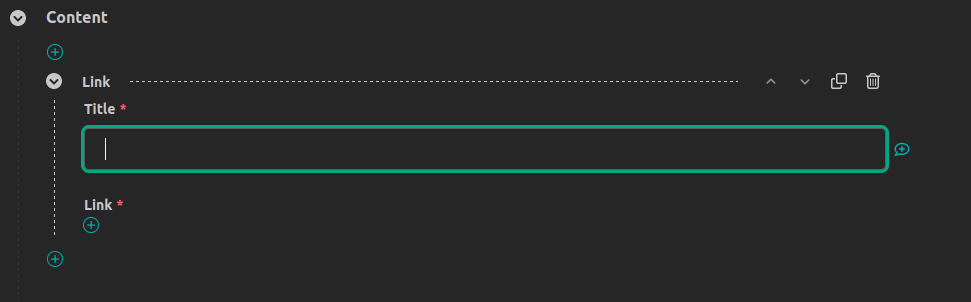
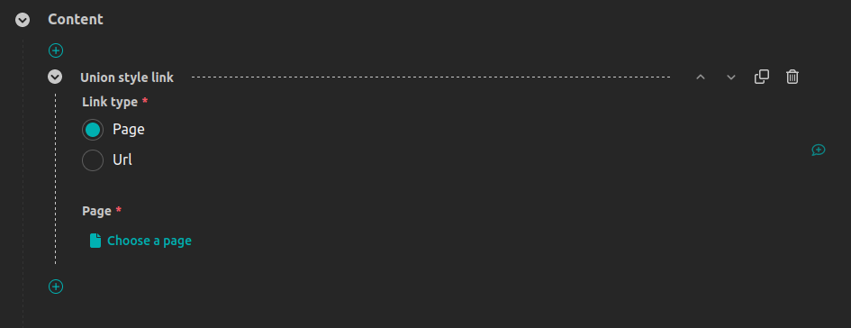

# RFC 94: Union Block

* RFC:
* Author: Joshua Munn <public@elysee-munn.family>
* Created: 2024-03-09
* Last Modified: 2024-03-09

## Abstract

This RFC proposes the implementation of a new stream field block type in Wagtail, the `UnionBlock`. The `UnionBlock` is a block type that presents editors with a choice of block types, allowing them to select one and insert a single corresponding "block" of content. The available choices for a given `UnionBlock` instance are defined by the developer, as with `StreamBlock`.

A proof of concept implementation can be reviewed at [https://github.com/jams2/wagtail/tree/feature/union-block](https://github.com/jams2/wagtail/tree/feature/union-block).

## Motivation

Wagtail's `StreamField` allows editors to author content with a great degree of flexibility. The facilities that enable this are the various `Block` types, which can be broadly summarised (some omissions for brevity) as follows:

- `StreamBlock`, a non-homogeneous sequence of other blocks;
- `ListBlock`, a homogeneous sequence of some block;
- `StructBlock`, a type that allows a set of blocks to be combined into a single compound block; and
- `FieldBlock` and its subclasses - atomic block types that capture a single value.

One notable omission from this family of types is a block that captures a single value from a union of types.

Unions are incredibly useful - they represent _choice_. Choice is currently represented in the block type family by `StreamBlock`. `StreamBlock` allows editors to create content comprised of any number of any type of block, in any order (subject to developer-defined constraints). However, Wagtail's block type family does not provide any facility for choice at the atomic block level, as `StreamBlock` is a sequence type.

`StreamBlock` is poorly suited to modelling a _single_ value, chosen from a union of types. The attempt to shoehorn `StreamBlock` into this use case is common, results in a suboptimal user experience for editors, and requires developers to write unwieldy code to work around the mismatch between use case and implementation.

### Example: Using `StreamBlock` to represent a single choice

#### Impact on UX

A common request from users of Wagtail CMS instances is the functionality to include a link in some fragment of structured content (e.g. as part of a call to action), where that link might point to:

- a web resource not provided by the Wagtail instance;
- a `Page` in the Wagtail instance; or
- an email address, etc.

In an attempt to provide the required UI (while working within the tools provided by Wagtail's core) developers will often implement a `StreamBlock` with a choice of link types, as illustrated below.

```python
class LinkChooserBlock(blocks.StreamBlock):
    page = blocks.PageChooserBlock()
    url = blocks.URLBlock()

    class Meta:
        max_num = 1


class LinkBlock(blocks.StructBlock):
    title = blocks.CharBlock()
    link = LinkChooserBlock()
```



The UI generated for inserting a link requires editors to first select the "+" button to insert a block, and then choose the block type. In the typical case that the link value is _required_ this creates dissonance between what is required by data validation and what is communicated to users by visual language - requiring users to insert a block when that block is required is a sub-par experience. Compare this to a link block implemented as a `UnionBlock`:



In this example all fields required to make a valid submission are immediately present in the UI, which clearly communicates the requirements of the system to users and prevents a class of validation errors from occurring.

#### Impact on code quality

Data inserted in stream fields is typically destined to be rendered as HTML and served as part of a web page. To facilitate this, blocks which implement a choice of types for a single value may be required to go through a process of narrowing to facilitate each possible sub-block's particular rendering requirements. In the case of our `LinkChooserBlock` example, we will need to invoke Wagtail's page URL resolution machinery if the page option is selected. A typical solution is to implement a custom `StructValue` class for the `LinkBlock`.

``` python
class LinkStructValue(blocks.StructValue):
    def get_url(self):
        block = self.get("link")[0]
        if (block_type := block.block_type) == "page":
            if block.value and block.value.live:
                return block.value.url
        elif block_type == "url":
            return block.value
```

Developers must deal with the fact the `link` field on `LinkBlock` is a sequence, which:

- is a poor mapping of the solution domain onto the problem domain; and
- requires error handling for the case that the sequence might be empty, regardless of the current validation constraints (the author suspects that developers that have worked with Wagtail regularly will empathise with the need for this).

Note: there may be more elegant/Pythonic/Wagtailish approaches than the one illustrated above, but it was taken from a real project, and the author believes it is representative of the kinds of solutions widely in use.

### Example: Using `StructBlock` to represent a single choice

Another approach that developers might take to provide a block that allows a single choice from a set of sub-blocks is to implement a `StructBlock` with a field for each sub-block, with custom JavaScript for the interface and custom validation. This is the approach taken by the [wagtail-link-block](https://github.com/developersociety/wagtail-link-block) package.

`wagtail-link-block` provides a `StructBlock` subclass with a field for each handled link type[^1]. Each sub-block is marked as optional, and a custom `clean` method enforces that a single value is provided[^2]. A `ChoiceBlock` is included to allow users to select their desired link type[^3]. Custom JavaScript is provided that hides the form fields for all except the one that corresponds to the chosen link type[^4].

This approach is reasonable, however the author feels that the underlying concept (a single value chosen from a union of types) has enough utility that it should be provided by Wagtail. The existence of the `wagtail-link-block` package illustrates that the use case is often required. A solution provided as part of Wagtail's core set of blocks would be more extendable, and present a consistent user experience. `wagtail-link-block` appears to be a well built package, but a criticism of it is that it is not simple to extend. A developer may wish to exclude the use of `mailto` links, for example, which would require interaction beyond the API presented by `wagtail-link-block`. If Wagtail provided a `UnionBlock`, developers would be empowered to implement their own union block types with arbitrary combinations of blocks.

### Example: Using `UnionBlock` to implement a link block

The following example shows how a `LinkBlock`, equivalent to the other examples in this section, would be implemented using `UnionBlock`.

``` python
class LinkChooserBlock(UnionBlock):
    page = PageChooserBlock(template="blocks/link_as_page.html")
    url = URLBlock(template="blocks/link_as_url.html")

class LinkBlock(blocks.StructBlock):
    title = blocks.CharBlock()
    link = LinkChooserBlock()
```

This approach to the `LinkBlock` problem requires developers to write less code - significantly less when taking into account the custom JavaScript required when taking the approach illustrated by `wagtail-link-block`.

In summary, the author believes that the UX and code quality improvements illustrated here present a compelling case for the inclusion of a `UnionBlock` in Wagtail.

## Specification

`UnionBlock` is a new block type that allows editors to select a block type from a set of types defined by the developer, and then insert a single value for that chosen type.

For each instance of `UnionBlock`, Editors should be presented with a `ChoiceField`, with one option for each sub-block that is a member of the union. When they make a selection, the UI should be updated so that the native form widget for the selected block type is presented. Only a single form field for the block's value should ever be presented. A default value must always be provided, as an empty choice requires editors to make an interaction to reveal a form field for the value, when they have already made an interaction indicating that they wish to enter a value when they selected the `UnionBlock` (or the block containing it) in a `StreamBlock`.

### Creation of subclasses

`UnionBlock` must support definition by subclassing. As with `StreamBlock` and `StructBlock`, a developer must be able to create a custom block type inheriting from `UnionBlock`, where the sub-blocks defined as class level attributes are the options available to editors.

`UnionBlock` must also support "anonymous" subclasses, like `StreamBlock` and `StructBlock`. For example, the following two definitions should be equivalent:

``` python
class MyUnion(UnionBlock):
    text = TextBlock()
    char = CharBlock()

my_union = UnionBlock([("text", TextBlock()), ("char", CharBlock())])
```

Any existing Wagtail block type should be valid for inclusion as a member of a `UnionBlock`.

### Implementation of the type selector

The base `UnionBlock` class must insert a `ChoiceField` into the UI, the choices of which have values that are the names of the declared sub-blocks, with the labels being the labels of those sub-blocks.

### Parameters and meta-options

`UnionBlock.__init__` must support a `local_blocks` keyword argument, in the first position, as with `StreamBlock` and `StructBlock`. If provided, this parameter must be a list of 2-tuples, where the first element is the name of the block option, and the second element is the block instance to use if that option is selected.

In addition to `local_blocks` (and the existing base block options), `UnionBlock` must support the following options, either as keyword arguments to its constructor, or attributes defined on its nested `Meta` class:

- `default_type` (`Optional[str]`, default value: `None`) - the name of the block to be presented as the default option to editors. If no parameter is passed, the first option should be automatically selected as the default. If the value is not in the set of names declared for that block, an error must be raised.
- `type_selector_label` (`Optional[str]`, default value: `"Type"`) - the label to be associated with the field presented to editors for selecting the type for a given block instance.
- `type_selector_widget` (`Optional[django.forms.Widget]`, default value: `None`) - the widget to use for the type selector field. If no widget is provided, Wagtail should default to Django's `RadioSelect` widget (as opposed to the `Select` widget, which is less usable/accessible).
- `value_label` (`Optional[str]`, default value: `"Value"`) - the label to associate with the value field presented to editors. This is provided for visual consistency and to reduce redundancy in the UI. As the sub-block labels will be used for the choices in the type selector field, they need not be repeated with the value field, and we prefer for less dynamic content in the UI.
- `value_class` (`Optional[UnionValue]`, default value: `None`) - the value class to use to represent the value of a `UnionBlock` instance in Python. If no value is provided, a base `UnionValue` class must be used.

### Help text

The help text declared for the `UnionBlock` must be presented at the top level of the block's UI.

The help text declared on any sub-block must be presented alongside the form field for that sub-block, whenever it is present in the UI.

### Validation

The implementation must validate that the selected type is a member of the declared sub-blocks.

The implementation must validate the provided value, using the selected block type's validation methods.

If a `UnionBlock` is marked as required, a valid value must be provided.

### Value classes

Similar to how `StructValue` is required for `StructBlock`, an extendable `UnionValue` class must be provided. This will allow developers to provide additional properties and methods, which may be required for the use of `UnionBlock` in the presentation layer.

The base `UnionValue` class must provide the following attributes:

- `block` - a reference to the relevant `UnionBlock` class;
- `block_type` - the name of the sub-block type that was selected for the given instance; and
- `value` - the value for the given instance, in the native format of the selected sub-block type (e.g. if the sub-block is a `CharBlock` this will be a `str`, if it is a `ListBlock` it will be a `ListValue`, if it is a `StructBlock` it will be a `StructValue`, etc.).

### Behaviour in templates

If Wagtail's `include_block` template tag is called with a `UnionValue` instance as its argument, it should defer to the `render_as_block` method of the associated `UnionBlock`.

If a `template` parameter/meta-option was supplied for the `UnionBlock` instance, `render_as_block` should render that template, with context supplied by the `get_context` method.

If no `template` parameter/meta-option was supplied for the `UnionBlock` instance, `render_as_block` should defer to the `render_as_block` method of the selected sub-block for that data instance.

This cascading approach will allow developers to either:

1. implement a single template that is used to render all union members; or
2. implement individual templates for each sub-block.

### Serialisation

The serialised value of a `UnionBlock` should be a JSON object, with the following required keys:

- `type` - the name of the `UnionBlock`;
- `value` - the serialised value of the selected sub-block; and
- `__union_type__` - a special key which serves two purposes:
    1. identifying which sub-block was chosen (its value should be a `str`, the name of the chosen sub-block); and
    2. disambiguating the `UnionBlock` from other block types.

### Deserialisation

When deserialising the JSON representation of a `UnionBlock`, a `UnionValue` instance should be created.

To deserialise the value of the chosen sub-block, Wagtail must:

1. consult the `__union_type__` field of the serialised object;
2. retrieve the corresponding block definition from the `UnionBlock`'s `child_blocks`; and
3. defer deserialisation of the `value` field to the sub-block.

If the sub-block indicated by `__union_type__` is not found on the `UnionBlock`'s definition (e.g. if the given sub-block is removed from the union after data has been committed to the database), a `UnionValue` with an empty `value` attribute should be created.

### Impact on external libraries

As `UnionBlock` is a new feature, it is not expected to impact existing external libraries. However, the following libraries may benefit from updates to support `UnionBlock`.

#### `wagtail-factories`

A `UnionBlockFactory` should be created to aid the creation of test data in projects.

#### `wagtail-streamfield-migration-toolkit`

A new `StreamBlockToUnionBlockOperation` operation would be a useful tool for projects where `StreamBlock` has been used as a surrogate `UnionBlock`. As part of the motivation for implementing `UnionBlock` is the historical (ab)use of single-value stream blocks, implementing this and documenting the migration pathway should be considered a necessary part of a complete solution.

#### `wagtail-grapple`

`wagtail-grapple` will likely need changes to handle `UnionBlock` in its GraphQL representation of stream fields.


[^1]: https://github.com/developersociety/wagtail-link-block/blob/219ad4cb543e2ed6da900d7c5c7a4be59ef58d27/wagtail_link_block/blocks.py#L70
[^2]: https://github.com/developersociety/wagtail-link-block/blob/219ad4cb543e2ed6da900d7c5c7a4be59ef58d27/wagtail_link_block/blocks.py#L133
[^3]: https://github.com/developersociety/wagtail-link-block/blob/219ad4cb543e2ed6da900d7c5c7a4be59ef58d27/wagtail_link_block/blocks.py#L77
[^4]: https://github.com/developersociety/wagtail-link-block/blob/219ad4cb543e2ed6da900d7c5c7a4be59ef58d27/wagtail_link_block/static/link_block/link_block.js#L8
