```mermaid
flowchart TD
    Start[🖼️ Image in the CMS] --> B{Vanilla image model\n alt text\n implementation?}
    B -- Yes --> G
    B -- No, custom alt text at model level --> C{Does the custom alt text use\n AbstractImage.default_alt_text\n  or AbstractRendition.alt?}
    C -- Yes --> D[Same as vanilla\n  implementation, except\n  bespoke alt text\n  could be mandatory]
    C -- No --> E([🟠 Uncharted territory,\n implementation-dependent])
    D --> G{How does the image render?}
    G -- In the CMS --> Y(["🔵 alt='{title}'"])
    G -- "Direct image reference\n  in template tag\n (ImageChooserBlock, foreign key)" --> YY(["🟠 alt='{title}'"])
    G -- Custom StreamField block --> K(["🔵 alt='{custom}'"])
    G -- In rich text --> R(["🟠 Contextual alt text\n  field pre-filled with title\n (opt-out of reusing title)"])
    R --> S(["🟠 alt='{contextual}'\n or alt='{title}' or alt=''\n based on user decision"])
```

```mermaid
flowchart TD
    Start[🖼️ Image in the CMS] --> B{Vanilla image model\n alt text\n implementation?}
    B -- Yes --> G
    B -- No, custom alt text at model level --> C{Does the custom alt text use\n AbstractImage.default_alt_text\n  or AbstractRendition.alt?}
    C -- Yes --> D[Same as vanilla\n  implementation, except\n  bespoke alt text\n  could be mandatory]
    C -- No --> E([🟠 Uncharted territory,\n implementation-dependent])
    D --> G{How does the image render?}
    G -- In the CMS --> J{Does the image have a\n description set?}
    J -- Yes --> W(["🟢 alt='{description}'"])
    J -- No --> Y(["🔵 alt='{title}'"])
    G -- "Direct image reference\n  in template tag\n (ImageChooserBlock, foreign key)" --> N{Does the image have a\n description set?}
    N -- Yes --> WW(["🟢 alt='{description}'"])
    N -- No --> YY(["🟠 alt='{title}'"])
    G -- Custom StreamField block --> K(["🔵 alt='{custom}'"])
    G -- New ImageBlock --> P{How does the user interact\n  with the image chooser UI?}
    G -- In rich text --> O{Temporary implementation\n  or ideal?}
    O -- Ideal, future --> P
    O -- Temporary, for now --> R(["🟢 Contextual alt text\n  field pre-filled with description\n  if set (opt-out of reusing description)"])
    R --> S(["🟢 alt='{contextual}'\n  or alt='' based on user decision"])
    P -- "They have just uploaded the image\n , pre-fill the alt text field\n  with the description\n  (opt out of reusing the description)" --> U(["🟢 alt='{contextual}'\n or alt='' based on user decision"])
    P -- "Pre-existing image,\n  empty alt text field;\n  opt-in for the user to reuse\n  the description if set" --> V(["🟢 alt='{contextual}'\n or alt='' based on user decision"])
```

```mermaid
flowchart LR
    Start[🖼️ Image in the CMS] --> B{Vanilla image model\n alt text\n implementation?}
    B -- Yes --> G
    B -- No, custom alt text at model level --> C{Does the custom alt text use\n AbstractImage.default_alt_text\n  or AbstractRendition.alt?}
    C -- Yes --> D[Same as vanilla\n  implementation, except\n  bespoke alt text\n  could be mandatory]
    C -- No --> E([🟠 Uncharted territory,\n implementation-dependent])
    D --> G{How does the image render?}
    G -- In the CMS --> J{Does the image have a\n description set?}
    J -- Yes --> W(["🟢 alt='{description}'"])
    J -- No --> Y(["🔵 alt='{title}'"])
    G -- "Direct image reference\n  in template tag\n (ImageChooserBlock, foreign key)" --> N{Does the image have a\n description set?}
    N -- Yes --> WW(["🟢 alt='{description}'"])
    N -- No --> YY(["🟠 alt='{title}'"])
    G -- Custom StreamField block --> K(["🔵 alt='{custom}'"])
    G -- New ImageBlock --> P{How does the user interact\n  with the image chooser UI?}
    G -- In rich text --> O{Temporary implementation\n  or ideal?}
    O -- Ideal, future --> P
    O -- Temporary, for now --> R(["🟢 Contextual alt text\n  field pre-filled with description\n  if set (opt-out of reusing description)"])
    R --> S(["🟢 alt='{contextual}'\n  or alt='' based on user decision"])
    P -- "They have just uploaded the image\n , pre-fill the alt text field\n  with the description\n  (opt out of reusing the description)" --> U(["🟢 alt='{contextual}'\n or alt='' based on user decision"])
    P -- "Pre-existing image,\n  empty alt text field;\n  opt-in for the user to reuse\n  the description if set" --> V(["🟢 alt='{contextual}'\n or alt='' based on user decision"])
```

# RFC 097: Alt Text Capabilities

* RFC: 097
* Author: Chiemezuo Akujobi
* Created: 2024-06-04
* Last Modified: 2024-06-04

## Abstract

In its current state, Wagtail’s alt text functionality presents a significant accessibility challenge. Its approach to alt text relies heavily on the implementation of developers who use Wagtail, with the only default mechanism being that when alt text is not provided, the title of the image is used as the alt text. The problem with this is that image titles are also defaulted to what the file is saved as, and site editors are not mandated to change the titles from this default. Research by Wagtail’s accessibility team has shown that many sites have not attempted to customize the alt text mechanism, instead, relying on the default to the title field. Much too often, this leads to a very poor experience for screen-reader users.

Additionally, the developers who create their own ways of enforcing alt text do so in a way that does not allow alt text to be tailored to the context in which the image is used. This is likely due to a general lack of awareness of the value that contextual alt text provides to users. Therefore with images in Wagtail, we have a lot of sites not adhering to Web Accessibility Standards, despite the developers behind them thinking otherwise.

## Intended Outcome

1. Improve Wagtail admin interface accessibility for the administrative users.
2. Make it easier for Wagtail implementers/developers to create an accessible image display on the front end of the website.

This RFC proposes a solution to improve the overall accessibility of Wagtail sites by expanding the alt text capabilities provided out of the box, thereby enforcing good practices. It approaches this by adding supported mechanisms for handling alt texts in their most common use-case scenarios; such as in `StreamField` Image blocks, `StructBlocks`, and by providing helpful image descriptions in the `AbstractImage` model.

Achieving these objectives, will by extension, provide a way for contextual alt text to be supported for images, especially when they appear in more than one place in a Wagtail website.

## Specification
> **Note**: Although the goals are similar, this document is a replacement for RFC [51](https://github.com/wagtail/rfcs/pull/51), as there have been changes to Wagtail since RFC 51 was written that no longer make its Proof of Concept's approach the most optimal. This document also includes some new improvements not covered in RFC 51.

There are three major changes needed:
1. Creation of an `ImageBlock` to support contextual alt-text.
2. Addition of a `description` field to the `AbstractImage` model.
3. Documentation efforts for both processes (1) and (2).

### 1. Creating `ImageBlock`
At this time of writing, Wagtail provides an `ImageChooserBlock`, and although we want to enforce standards and advocate for best practices, we do not want to make breaking changes or affect backward compatibility. This is the reason we will be creating a new block for images. 
We want a new block that can leverage existing logic and provide a means to add alt text, as well as a way to indicate whether certain images are purely decorative instead, while not needing us to change the existing `ImageChooserBlock` implementation. This will be the first major change. The name `ImageBlock` has been selected (although still up for deliberation) because for other StreamField blocks, the prefixes convey what their types are: such as `RichTextBlock` for rich text, `CharBlock` for characters, `EmailBlock` for emails, and so on. 

This `ImageBlock` class will subclass the `StructBlock` class, and it will have three properties:
1. An `image` property, which is an `ImageChooserBlock`.
2. An `alt_text` property, which is a `CharBlock.
3. A `decorative` property, which is a `BooleanBlock` (which renders as a checkbox)

These properties only define the visual layout in the Admin interface, but do not handle custom logic. To cater to this, this RFC proposes introducing and registering ImageBlock-specific Javascript logic (a new static file) for the Admin interface, to allow the `alt_text` field to be enabled/disabled by toggling the `decorative` checkbox. If disabled, the field will be cleared and its value will be an empty string. Additionally, this RFC proposes that the native Python value of this new block (as returned from `to_python`) be an Image instead of a Dict-like `StructValue`. This will make alt text detection automatic when the `` template tag is used. The `ImageBlock’s` behaviour will be identical to the behaviour already in place for the `ImageChooserBlock`. To achieve this, this RFC proposes overriding some parent methods, particularly the ones that typically return Dict values, as will be shown in the snippet in the paragraph below. Optionally, a decision can be made on whether or not alt texts of images should be searchable.

Do take a look at some snippets of the sample code implementation [here](https://github.com/wagtail/wagtail/pull/11791/files) (including a sample template).

### 2.  Adding a `description` field to `AbstractImage`

The next major action is to improve image accessibility **within** the Admin interface for administrative users/editors. For this, we will add a `description` field to the AbstractImage class for a high-level overview of the image. It will be used as the alt text inside the image listing view and inside image picker dialogs. With this in place, the behaviour of the gallery in the admin interface would be such that stored images are described, and these descriptions can be prompted as suggestions editors can prefill the `alt_text` field with when they use the `ImageBlock`. The `description` will also provide a better fallback in the absence of `alt_text` (such as when Images are used within `ImageChooserBlock`, `ImageBlock`, etc) than the `title` field. These new features would be important to screen-reader users using the Wagtail admin, and it would be a step in mentally preparing editors to be thorough with alt text at the point of image usage. However, with backward compatibility in mind, this new field will be optional and default to a blank string for existing images. There will be a warning message that shows at the image upload/edit form that indicates that although the the field is optional, Wagtail recommends editors fill it. 

### 3. Documentation efforts
We will include a note in the upgrade considerations on how developers can migrate. In practice, some developers have added their own alt text field to their custom image model. These migration instructions will help this group of developers migrate from their own alt text field to the new image description field.

## Caveats

Here are some of the things we will ideally not be doing:
1. We will not be doing away with the title field for the AbstractImage model. This is because titles will still be used to identify specific images, especially among a list or point of reference.

For things that we will ideally be doing, this RFC will address them in a flowchart of the proposed flow below.

## Flowcharts of Existing Flow vs Proposed Flow

### Existing Flow

#### Top-down

#### Left-right

```mermaid
flowchart LR
    Start[🖼️ Image in the CMS] --> B{Vanilla image model\n alt text\n implementation?}
    B -- Yes --> G
    B -- No, custom alt text at model level --> C{Does the custom alt text use\n AbstractImage.default_alt_text\n  or AbstractRendition.alt?}
    C -- Yes --> D[Same as vanilla\n  implementation, except\n  bespoke alt text\n  could be mandatory]
    C -- No --> E([🟠 Uncharted territory,\n implementation-dependent])
    D --> G{How does the image render?}
    G -- In the CMS --> Y(["🔵 alt='{title}'"])
    G -- "Direct image reference\n  in template tag\n (ImageChooserBlock, foreign key)" --> YY(["🟠 alt='{title}'"])
    G -- Custom StreamField block --> K(["🔵 alt='{custom}'"])
    G -- In rich text --> R(["🟠 Contextual alt text\n  field pre-filled with title\n (opt-out of reusing title)"])
    R --> S(["🟠 alt='{contextual}'\n or alt='{title}' or alt=''\n based on user decision"])
```

### Proposed alt flow

#### Top-down

#### Left-right

