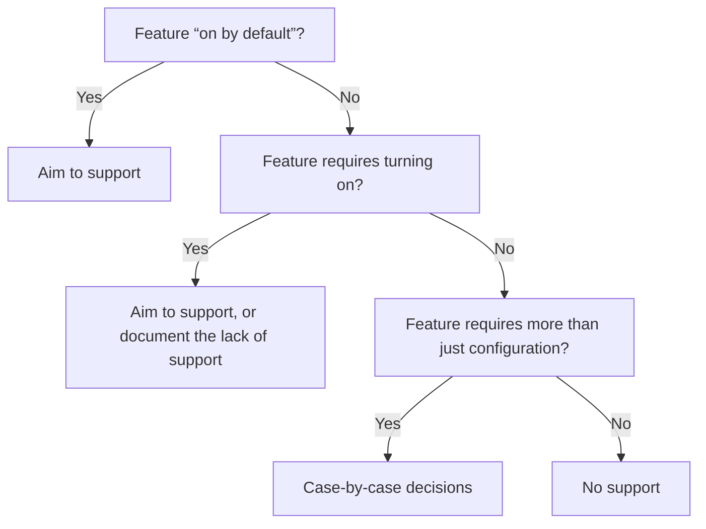

# RFC 100: Headless support in Wagtail core

- RFC: 100
- Author: Thibaud Colas
- Created: 2024-07-31
- Last Modified: 2025-01-29

## Abstract

Wagtail’s support for headless websites should move closer to feature-parity with Django monoliths, without reliance on third-party packages for compatibility with core functionality.
For features that aren’t supported because of technical constraints, design decisions, or inertia, there should be documented workarounds or alternatives.

This RFC aims to define our goal for support of those features, not the mechanism by which any one feature should be supported.

## Why we need this

Having a clear vision of which features are or aren’t supported will help site implementers, contributors, maintainers, stakeholders make better decisions.

- A lot of existing and future sites would benefit from more cohesive headless support.
- It’s harder to maintain headless support workarounds across external packages.
- It’s important for Wagtail to express a clear vision of supported site architectures.

## Support goals

To determine whether a Wagtail features should be supported for headless websites, we follow these rules.

- If a feature is “on by default” in Wagtail, we must aim to support it with no need for additional packages, and minimal to no custom implementation.
- If a feature is included by default but opt-in via configuration, we should aim to support it, or its lack of support for headless setups should be clearly documented.
- For Wagtail features that require more than basic configuration to leverage, their support of headless websites and the state of their documentation is on a case-by-case basis.

Here they are as a flowchart:



### Definition of “On by default”

Features are considered to be “on by default” if they are included and turned on in:

- Wagtail core’s Django apps that are musts for Wagtail to function (`wagtail`, `wagtail.admin`, etc).
- The [default project template](https://docs.wagtail.org/en/stable/reference/project_template.html).
- The [Integrating Wagtail into a Django project tutorial](https://docs.wagtail.org/en/stable/getting_started/integrating_into_django.html).
- The [full getting started tutorial](https://docs.wagtail.org/en/stable/tutorial/index.html).

### Support

Feature parity is the ideal to strive for but isn’t a realistic goal in most cases. Instead, we aim for “full” or “partial” support targets with the understanding that ways to leverage the features and level of configuration required will differ.

For example, integrating the [Wagtail user bar](https://docs.wagtail.org/en/stable/topics/writing_templates.html#wagtail-user-bar) in Django Templates only requires loading a tag library and using a template tag:

```twig


```

In a headless setup, the code could be similar but have much more underlying requirements:

```html
<script src="https://cms.example.com/static/wagtail-userbar.js">
<wagtail-userbar page-id="5"></wagtail-userbar>
```

In this implementation example, there is some effort to keep the integration requirements simple, but still a need for the headless CMS to serve a script file, and for the site implementer to provide the page ID to the userbar (rather than it inferring it from context).

## Current and desired state

To support future headless improvements work, here is a non-exhaustive list of key areas and their current vs. ideal state.

### Overview

Items in this overview are ordered per the [Results of the 2024 Wagtail headless survey](https://wagtail.org/blog/2024-headless-survey/).

| Feature              | Current state    | Ideal state               |
| -------------------- | ---------------- | ------------------------- |
| Page preview         | External package | Built-in support          |
| REST API             | Built-in support | Improved built-in support |
| Documentation        | High-level docs  | Detailed docs, how-tos    |
| API schemas          | No support       | Built-in support          |
| Images               | Built-in support | Improved built-in support |
| Page URL routing     | Built-in support | Improved built-in support |
| Multi-site support   | Built-in support | Improved built-in support |
| Rich Text            | Built-in support | Improved built-in support |
| Redirects            | Built-in support | Improved built-in support |
| Form submissions     | No support       | Built-in support          |
| StreamField          | Built-in support | Improved built-in support |
| GraphQL              | External package | External package          |
| Internationalisation | Built-in support | Improved built-in support |
| Content checks       | No support       | Built-in support          |
| Private pages        | No support       | Built-in support          |
| Userbar              | No support       | Built-in support          |
| Snippets             | No support       | Built-in support          |
| Settings             | No support       | Built-in support          |

### Page Preview

Page previews should be supported by Wagtail core. Currently, [wagtail-headless-preview](https://github.com/torchbox/wagtail-headless-preview) is required.

### REST API

The REST API needs better documentation, and improvements to its capabilities. This could take the form of a "v3" API, or gradual improvements to the current v2 API.

See all [issues tagged component:API](https://github.com/wagtail/wagtail/issues?q=sort%3Aupdated-desc+is%3Aopen+label%3Acomponent%3AAPI). Here are specific issues worth highlighting:

- [Allow unlimited API results with `limit=-1` #12604](https://github.com/wagtail/wagtail/issues/12604)
- [Wagtail API: Greater than/less than filters #7497](https://github.com/wagtail/wagtail/issues/7497)
- [Wagtail API: OR filtering related models #5755](https://github.com/wagtail/wagtail/issues/5755)
- [Add ability to include and filter via detail fields on pages' list endpoints #11404](https://github.com/wagtail/wagtail/issues/11404)
- [Random order in the API leading to an AttributeError #3512](https://github.com/wagtail/wagtail/issues/3512)
- [Wagtail API should have a browsable root URL #1921](https://github.com/wagtail/wagtail/issues/1921)
- [Duplicate db query on api detail page #6133](https://github.com/wagtail/wagtail/issues/6133)
- [Adding per-subclass filter backend/class to the v2 API Pages Endpoint #3403](https://github.com/wagtail/wagtail/issues/3403)
- [Future release enhancement: Implement APIField for listing_default_fields, too #3562](https://github.com/wagtail/wagtail/issues/3562)
- [Document `nested_default_fields` in APIv2 #11587](https://github.com/wagtail/wagtail/issues/11587)
- [Add a UUIDField to the Page model #6162](https://github.com/wagtail/wagtail/issues/6162)
- [Support customizing/encoding IDs in the API #6917](https://github.com/wagtail/wagtail/issues/6917)

Other ideas:

- Have an endpoint to retrieve all page URLs.

### Documentation

See [Headless docs](https://github.com/wagtail/wagtail/pull/12039) pull request. Headless support for various features needs to be covered in the developer documentation, either as a dedicated “headless support” page, or separately feature by feature, or both.

### API schemas

In addition to discrete improvements to the API endpoints, an often-requested feature is API schema generation (OpenAPI / Swagger). See: [Support OpenAPI Schema generation for Wagtail API #6209](https://github.com/wagtail/wagtail/issues/6209).

### Images

It should be simpler to retrieve renditions of images via the API, and there are a few other pain points. See:

- Add focal point information in the API response, to match support for [accessing the focal point in templates](https://docs.wagtail.org/en/stable/advanced_topics/images/focal_points.html#accessing-the-focal-point-in-templates).
- [ImagesAPIViewSet query params for rendition? #7973](https://github.com/wagtail/wagtail/issues/7973)
- [No Image URL in the API for ImageChooserBlock #2087](https://github.com/wagtail/wagtail/issues/2087)
- [Feature request: Include image's title in ImageRenditionField #5435](https://github.com/wagtail/wagtail/issues/5435)
- [Documentation for using the "Dynamic image serve" view for generating image renditions on a headless site #6113](https://github.com/wagtail/wagtail/issues/6113/)

### Page URL Routing

The [`get_url_parts`](https://docs.wagtail.org/en/stable/reference/pages/model_reference.html#wagtail.models.Page.get_url_parts) method needs better "how-to" documentation representative of its usage for headless websites. There could be room for improvement with `RoutablePageMixin` too. There are other known pain points in querying the data for the correct page for a given route:

- [Keep queries other than html_path in /api/v2/pages/find/ #6577](https://github.com/wagtail/wagtail/issues/6577)
- [Finding pages by HTML Path - redirect missing port #7595](https://github.com/wagtail/wagtail/issues/7595)
- [Improvements to API router reverse lookups. #11310](https://github.com/wagtail/wagtail/pull/11310)
- [Add ability to support custom renderers for Page views (e.g. JSON API response at page URLs) #11752](https://github.com/wagtail/wagtail/issues/11752)
- [Accept page change in before_serve_page handling #5753](https://github.com/wagtail/wagtail/issues/5753/)

### Multi-site support

The Wagtail API only allows requests from one site at a time to make sure any site listings are isolated from other sites by default. But the API could be improved in the following ways:

- Allow the site to be specified in the API request.
- Allow all pages across all sites to be queried on an opt-in basis.

With these approaches, the site record in the Wagtail admin of Headless Wagtail would be set to the domain or port that the end user sees so URLs could be reversed correctly. All API requests would specify the site as a GET parameter.

### Rich Text

Wagtail should make it more straightforward to access rendered HTML. See [API should provide access to the HTML-converted versions of rich text fields #2695](https://github.com/wagtail/wagtail/issues/2695).

### Redirects

Wagtail provides a `RedirectsAPIViewSet`. It needs further improvements – see [Refactor redirect middleware to use its lookup logic for redirects API #11524](https://github.com/wagtail/wagtail/pull/11524).

### Form submissions

This feature is a regular selling point for Wagtail, though its usage is limited on headless projects. Nonetheless, Wagtail should have basic support for API interactions with forms and form submissions, or documented workarounds.

Currently, Wagtail supports [adding form fields to the API](https://docs.wagtail.org/en/stable/advanced_topics/api/v2/configuration.html#adding-form-fields-to-the-api) but lacks support for submissions: [Ability to accept Form Builder Page as a POST request to the API (headless) #6950](https://github.com/wagtail/wagtail/issues/6950).

In addition to facilitating data management, this would also help developers avoid reinventing form validation.

### StreamField

There are a number of very simple improvements that could be made so developers have more control over the API representation of StreamField blocks, starting with documentation of the `get_api_representation` method.

- [Override serializing StreamBlocks to JSON api #3454](https://github.com/wagtail/wagtail/issues/3454)
- [Apply custom-per-block-type StreamField serializers #5174](https://github.com/wagtail/wagtail/issues/5174)
- [parent_context or just "parent Page" for Block.get_api_representation() #7976](https://github.com/wagtail/wagtail/issues/7976)

### GraphQL

GraphQL and packages like [wagtail-grapple](https://github.com/torchbox/wagtail-grapple) or [strawberry-wagtail](https://github.com/patrick91/strawberry-wagtail) should remain separate. There is no requirement for Wagtail to support multiple types of APIs as a core feature.

### Internationalisation

See [Support internationalized routes in API pages/find/?html_path view #6679](https://github.com/wagtail/wagtail/issues/6679).

### Content checks

Including all [accessibility checker](https://docs.wagtail.org/en/stable/advanced_topics/accessibility_considerations.html#built-in-accessibility-checker) capabilities, and content metrics. Only available via the userbar. In addition to the userbar, also requires:

- Page Preview
- Cross-domain cross-frame communication

### Private Pages

Password-protected pages are currently excluded from the API. There currently isn’t a way to view a password-protected page from a headless frontend.

### Userbar

Only available as a Django Templates template tag or Jinja2 function. Requires:

- Loading of Wagtail static assets (CSS & JS)
- Loading of Wagtail UI components (HTML / Django Templates)
- (Authentication and authorization)

Likely implementation:

- Web Component (`<wagtail-userbar content-type="blog.BlogPage" pk="80"></wagtail-userbar>`)
- Data fetching from Wagtail backend via dedicated API endpoint.
- UI fetching from script tag or from Wagtail backend (via API endpoint?)

### Snippets

There is currently no specific support to retrieve snippets via the API. There is room for Wagtail to provide a good recipe in the documentation.

### Settings

There is currently no specific support to retrieve settings via the API. There is room for Wagtail to provide a good recipe in the documentation.

## Open Questions

### Is there a point in supporting JSON schemas of API responses?

This would be as an alternative to OpenAPI.

### Is there room to better support (front-end) cache invalidation?

Possibly?

> Because the frontend acts as a cache, it needs to be invalidated/purged. In Wagtail, it is necessary to track which object is used on which page so that when content is mutated, the correct frontend components/pages are invalidated/purged.

### How actively should we consider alternatives to Django REST Framework?

See [Moving REST framework forward #9270](https://github.com/encode/django-rest-framework/discussions/9270), and the popularity of [Django Ninja](https://django-ninja.dev/).

### How about a write API?

Any improvements towards a "headless admin" are considered out of scope for this RFC. For example, proposals for a [write API](https://github.com/wagtail/wagtail/issues/4667) are welcome, but aren’t relevant for the majority of headless websites.

### What kind of story to we want to tell when it comes to emerging community practice such as HTMX/Turbo style applications? Or do we consider this not really 'headless'?

Those are relevant patterns for Wagtail to consider but out of scope for this RFC, as with those patterns it’s still the CMS application server that generates the pages’ HTML.

### Would we want to consider a more open schema driven response structure ever?

Maybe! As in – [JSON:API](https://jsonapi.org/) or JSON-LD.

### Should we have a headless demo site?

Maybe. There have been a few attempts in the past, more recently [bakerydemo-nextjs](https://github.com/thibaudcolas/bakerydemo-nextjs).
