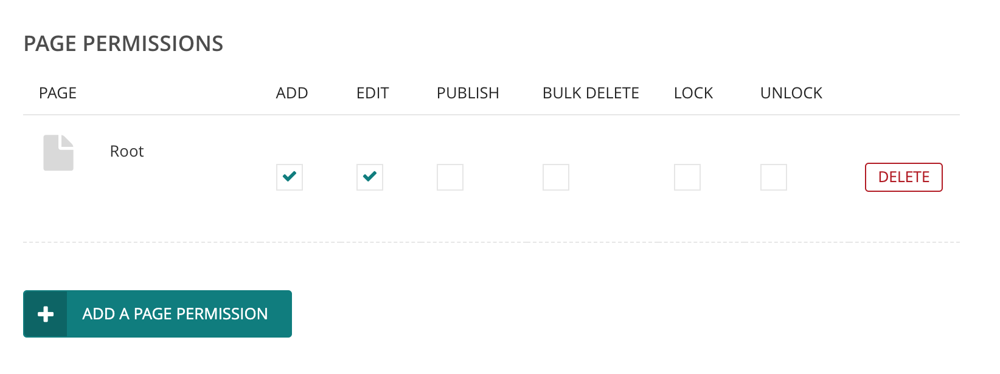
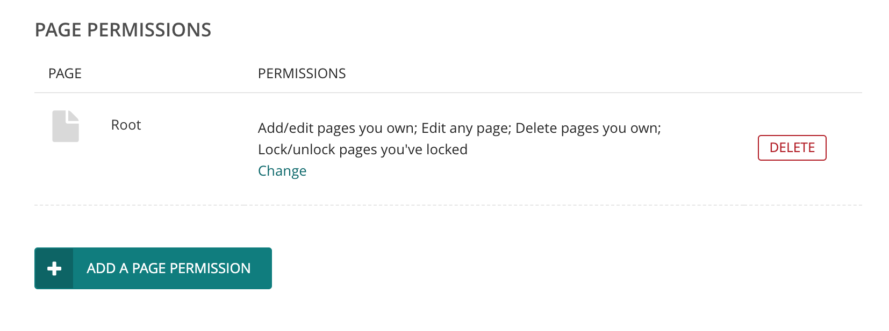

# RFC x: Delete page permission

* RFC: x
* Author: Matthew Westcott
* Created: 2020-06-05
* Last Modified: 2020-06-05

## Abstract

Traditionally, Wagtail's permission model has treated page deletion as equivalent to editing, on the basis that deletion is no more destructive than editing out the content from a page, and withholding delete permission will tend to result in editors using unsatisfactory workarounds, e.g. changing titles to "DELETE ME" or "DO NOT USE". However, deletion does differ in that revision history is not preserved, which may be particularly significant in settings with strict audit logging requirements. We therefore propose splitting deletion into a separate permission type.

## Specification

Two new permission types (i.e. choices for the `permission_type` field of the GroupPagePermission model) will be created:

* `delete_own` - delete pages you own
* `delete_any` - delete any page

These correspond to the deletion rights currently provided by the `add` and `edit` permission types respectively; when the new permission types are added, a data migration will be provided that adds a new `delete_own` or `delete_any` alongside any existing `add` / `edit` permissions. (Projects that programmatically define permissions through other mechanisms - e.g. fixtures, or setUp methods within unit tests - will need to be updated accordingly.)

The permission rules in PagePermissionTester (and elsewhere as necessary) will be updated to use these new permission records for deletions. The "bulk delete" permission will still be enforced as per its current meaning: a user must have `bulk_delete` permission in addition to `delete_own` / `delete_any` to delete a page with child pages.

### Permission UI changes

The grid layout for page permissions currently has six checkboxes per row, and adding more at this point would become unwieldy, especially on mobile:

This will be changed to a new interface where the currently assigned permissions are shown in a list, with the option to change these (which will open up a list of labelled checkboxes, either in a lightbox or inline).

## Alternative approaches

A soft-deletion option for pages has been proposed (see discussion on [#2213](https://github.com/wagtail/wagtail/issues/2213) and [#2907](https://github.com/wagtail/wagtail/issues/2907)) where page revisions are preserved, and deleted pages can be restored by a user with appropriate permissions. Soft deletion would thus be no more destructive than regular editing, and this would avoid the need for any new editor-level permissions or loss of editor functionality. However, it would require new administrator-level permissions and UI for handling page restoration and hard-deletion, as well as more extensive data model changes to ensure that soft-deleted pages were excluded from navigation, APIs and so on.